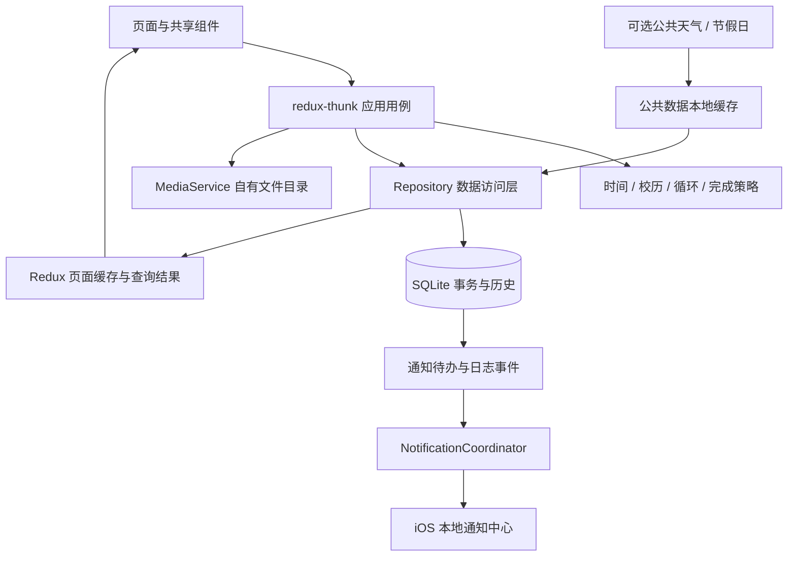
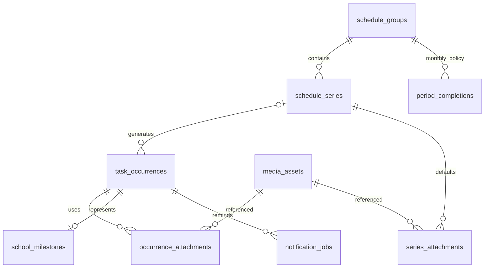

# Big Fat Fish｜小学班主任个人工作台 PRD 与架构方案

版本：v0.5 评审稿（已同步倒计时公式与非固定高频使用场景）

日期：2026-09-06

目标平台：仅 iOS，首版面向 iPhone 竖屏

目标用户：小学班主任，单人、单设备使用

首期使用范围：仅测试版个人使用，不对外分发或公开上架

文档范围：产品需求、页面骨架、导航契约、数据设计、基础技术调研、验收方案。本文不是已实现功能说明。

## 1. 产品目标与范围

让老师在一个轻量、明亮的个人工作台中完成“看今天要做什么 → 及时收到提醒 → 记录文字、图片或录音 → 标记完成 → 按周回看和检索”。核心操作不依赖登录、服务器或网络。

首版包含首页、周日历、普通日程与请假记录录入、详情与编辑、所有日程查询、循环日程、校历倒计时、节假日展示、每日寄语、本地附件、本地通知和本地日志。天气为公共数据增强能力，见第 3、12 节。

首版不扩展学生档案、成绩、考勤统计、班级群、家校沟通、云同步、多端协作、账号、付费、Android、Web。参考首页截图中的学生、成绩、生日、新闻等模块仅为视觉参考，不进入需求。

### 1.1 需求措辞与本稿采用的解释

| 编号 | 原诉求或歧义 | 本稿建议／默认解释 | 状态 |
| --- | --- | --- | --- |
| D01 | 9 月 1 日至次年 1 月 17 日写作“寒假” | 修正为“秋季学期” | 用户已确认 |
| D02 | 时间段边界 2/21、7/8、9/1 重叠 | 使用左闭右开区间，边界当天归新阶段 | 设计建议 |
| D03 | 下个节点未录入时提示；1/31 的原示例要求补寒假日期 | 按默认常量判断当前阶段，仅补下一个节点：假期补开学，学期补放假；不追补当前阶段起点 | 用户已确认，以本次答复为准 |
| D04 | 保存一律用系统当年 | 普通同年节点用当年；跨年寒假用目标节点年份，如 2026 年秋季对应 2027 年寒假 | 用户已确认 |
| D05 | 全部离线，同时需要天气／节假日接口 | 个人业务始终本地；允许天气与节假日公共数据联网，断网回退到内置数据／缓存，不上传业务信息 | 用户已确认 |
| D06 | 语音录入 | 只做本地录音、保存和播放，不做语音转文字 | 用户已确认 |
| D07 | 每日晨午检、看餐 | 仅工作日提醒；官方调休补班周末按工作日处理，排除官方休息日；寒暑假停提醒规则保留 | 用户已确认 |
| D08 | 请假属于谁、是否影响其他提醒 | 仅记录学生请假及姓名；没有学生与其他事务的关联，不暂停其他事务提醒 | 用户已确认 |
| D09 | 取消循环即批量删除 | 保留当前和历史记录，只取消未来未完成记录；未来已完成记录同样保留，操作前预览影响范围 | 用户已确认 |
| D10 | 已搭好 Redux 基础 | 已有依赖和 Provider，但当前为空 reducer；后续开发时需替换空组合 reducer，避免开发环境空 reducer 警告 | 现状核查 |
| D11 | 每日任务的提醒方式 | 使用 iOS 系统本地通知；App 在后台、进程未运行时由系统负责展示，前提是已授权且该提醒已排入系统；App 内仅作为补充状态 | 用户已确认 |
| D12 | 调休补班与各类提醒 | 官方日期覆盖优先于星期：调休补班周末视为工作日，所有原定提醒照常；非补班周末、官方休息日及寒暑假停提醒 | 用户已确认 |
| D13 | 首期使用／分发 | 仅测试版个人使用，不对外分发或公开上架 | 用户已确认 |
| D14 | 节日倒计时 | （节日当天 00:00 时间戳 − 今天 00:00 时间戳）÷ 86,400,000；统一北京时间 | 用户已确认 |
| D15 | App 打开频率 | 打开时间不固定，学期内使用频率高；启动和恢复前台时自动补齐通知，不要求固定周期签到 | 使用场景已确认；长期未打开的覆盖风险保留 |

这些默认值使方案可评审、可估算，不代表客户已经确认所有存在歧义的业务规则。

### 1.2 一期成功标准

- 飞行模式首次启动仍能初始化，新增／编辑／删除／完成／查询事务及录音播放、图片查看均可用。
- 删除相册原图后，已成功导入的 App 图片仍可查看。
- 循环事务按“每次发生”独立完成；重启不重复生成，不复活已取消实例。
- 通知设置失败不会导致已保存事务丢失；界面能区分“已保存”与“提醒已安排”。
- 班主任无需理解表达式即可创建每天、每周、每月、月底等循环。
- 所有主要页面使用同一张事务卡片与同一套完成、取消和时间语义。

## 2. 现有工程与总体架构

### 2.1 工程基线

本次只读核查：Expo `~57.0.19`、Expo Router `~57.0.18`、React Native `0.86.3`、React `19.2.3`、Redux `^5.0.1`、React Redux `^9.3.0`、redux-thunk `^3.1.0`、TypeScript strict。现有页面为根布局与简单首页，store 尚无业务模块。

Expo SDK 57 官方兼容表列出 React Native 0.86、React 19.2.3，iOS 最低 16.4+、Xcode 26.4+、Node.js 最低 22.13.x。因此首版暂定 iOS 16.4+，实际工程 deployment target 和最终依赖要求在开发前复核；不为本需求自行升级现有框架。[Expo SDK 57](https://docs.expo.dev/versions/v57.0.0/)

### 2.2 架构决策

SQLite 是业务数据唯一可信来源；Redux 保存当前页面需要的可序列化数据和查询状态；redux-thunk 串联校验、数据库事务及后续通知协调。图片和音频文件存沙箱，数据库不存大段 base64。系统通知队列是可重建的外部状态，不能充当日程数据库。



| 层／模块 | 职责 | 边界 |
| --- | --- | --- |
| Expo Router | 路由栈、底部 Tab、导航恢复 | 不携带数据库连接或完整事务对象 |
| 页面／组件 | 表单、列表、交互、无障碍 | 不直接执行 SQL 或系统通知调度 |
| Redux | entities、查询 ID 列表、loading/error、初始化状态 | 不存播放器、Date、Promise、文件句柄；不持久化整个 store |
| Thunk 用例 | create/update/delete/complete/query、错误归一化 | 通过 service/repository 调用，不在 reducer 中做副作用 |
| Domain | RRULE 展开、唯一键、校历目标、月底完成策略 | 纯业务算法，便于独立验证 |
| Repository | SQL 查询、索引、事务、迁移 | 所有写入序列化，参数绑定 |
| MediaService | 导入、重命名、校验、引用和垃圾回收 | 原始相册 URI 只作导入源 |
| NotificationCoordinator | 差异排队、撤销、重试、覆盖范围计算 | 不假设 JS 常驻，不承诺全年后台补齐 |
| LogService | 事务日志落盘与按月清理 | 不记录文案全文、录音内容、图片内容 |

拟议目录（仅方案，本次不创建这些业务模块）：

```text
src/
  app/                   路由文件
  features/
    home/ calendar/ tasks/ search/ school-calendar/
  components/            TaskCard、TaskForm、附件、日期范围等
  store/                 reducers、typed hooks、thunks
  domain/                recurrence、date、completion-policy
  data/                  migrations、repositories、bundled datasets
  services/              bootstrap、media、notifications、logs、public-data
  theme/                 色彩、字号、间距
assets/                  图标、App 图标、寄语、节假日离线包
modules/                 仅在 Expo API 不满足时新增 Swift 模块
```

### 2.3 基座与冷启动

基座页面自身只管理 Tab 的切换／挂载，业务初始化由根部 BootstrapService 统一运行，避免每次切换 Tab 重复初始化。保留已访问 Tab 的滚动位置；首次访问才渲染大列表，空闲时可预取本周 ID。

启动顺序：

1. 立即展示亮色启动骨架；捕获通知启动意图，不立即跳转。
2. 创建目录，打开 SQLite，完成 schema migration、外键设置、基础配置读取。
3. 幂等创建内置规则，优先补今日与本周实例；加载首页首屏。
4. 路由就绪后优先处理通知跳转，再决定是否展示校历补录表单。
5. 分批补齐本年度剩余实例、恢复中断写入、对账通知队列、日志维护。
6. 若允许公共联网，独立刷新已过期的天气／节假日；超时不阻塞启动。

迁移失败时保持旧库，展示“本地数据暂时无法打开／重试”，禁止直接删库重建。全量年度补齐与媒体扫描不放在首屏关键路径。恢复前台、跨午夜和系统时间变化也会触发轻量刷新。

## 3. 离线、权限与能力结论

| 能力 | 首选方案 | 离线表现／限制 | 是否预计需要 Swift |
| --- | --- | --- | --- |
| 本地数据 | expo-sqlite + Repository | 完全离线；支持索引、关联、事务、迁移 | 否 |
| 图片导入与回显 | expo-image-picker + expo-file-system + 已有 expo-image | 导入成功后完全离线；仅在 iCloud 的原图首次取回可能需要网络 | 通常不需要 |
| 大图 | RN Modal + Gesture Handler/Reanimated + expo-image | 本地缩放、拖动、翻页 | 否 |
| 本地提醒 | expo-notifications / iOS UserNotifications | 预排通知离线交付；队列有容量边界，受系统通知设置影响 | 通常不需要，必要时补诊断适配 |
| 法定节假日 | 已核验年度 JSON 内置 + 可选公共数据更新 | 内置年份可用；未知年份不能伪造调休 | 否 |
| 录音与播放 | expo-audio + 持久化目录 | 完全离线；需要麦克风权限 | 否 |
| 语音转文字 | 用户已明确不需要 | 不进入首版，不申请语音识别权限 | 不需要 |
| 天气 | 公共天气 API + 手动选城市 + SQLite 缓存 | 断网只能显示带时间的缓存／占位，不可能得到实时新天气 | 无服务器方案通常不需要 |
| 图标 | SF Symbols／已下载许可图标 | 打包内置，不在页面渲染时请求网络 | 否 |

默认权限策略：首次真正录音时申请麦克风；用户首次启用提醒或完成内置提醒说明后申请通知；点击导入图片时使用系统选图器，按所选 API 模式申请所需权限，不预先要求全相册；首版不需要相机、通讯录、系统日历或持续定位权限。天气使用手动城市选择。

“本地持久化”不等于永不丢失：App 卸载会删除其沙箱；iOS 系统备份与 App 自行联网同步是两回事。本稿默认不提供 App 云同步，保留系统正常备份行为。若客户要求连系统 iCloud 备份也排除，需另行明确备份策略与本地导出／恢复需求，不应顺手禁用用户数据备份。[Apple 文件存储建议](https://developer.apple.com/documentation/foundation/using-the-file-system-effectively)

## 4. 视觉与共享交互规范

### 4.1 参考图与 App 图标

首页参考：[客户工作台截图](/Users/waynelee/Downloads/A77A14EA-8CBC-462F-8B73-C1D7358C56FE.jpeg)，703 × 1547。提取奶白底、薄荷绿／淡黄／浅粉渐变、柔和圆角、轻阴影和宽松留白；不照搬截图的信息架构。

App 图标指定原图：[IMG_6622.JPG](/Users/waynelee/Downloads/IMG_6622.JPG)，1081 × 1079。后续以该图制作 1024 × 1024 的图标底稿，优先保留人物脸部与思考姿态，不添加文字；主界面仍用亮色体系，不由图标深色背景决定页面主题。当前工程 `ios.icon` 指向 `assets/expo.icon`，后续要同步更新实际 iOS 图标入口，不能只替换通用 PNG。制作流程参考 [Apple Icon Composer](https://developer.apple.com/documentation/xcode/creating-your-app-icon-using-icon-composer)。本次保留参考路径，不处理图片或替换工程资产。

### 4.2 设计 token（建议值）

| 用途 | 建议 |
| --- | --- |
| 页面底色 | `#F7FAF6`，卡片 `#FFFFFF` |
| 主色 | `#4E8B75`，浅底 `#E8F4EC` |
| 主文字／次文字 | `#263B32` / `#596B61`；避免浅灰正文 |
| 温暖提示 | `#FFF3D9` 底 + `#78531C` 字 |
| 逾期提示 | `#FCE9E3` 底 + `#934634` 字，配“已逾期”文案 |
| 完成状态 | 淡绿背景、勾选、完成标签；可弱化但仍清晰 |
| 圆角／间距 | 卡片 20 pt；按钮 14 pt；页面边距 16 pt；8 pt 间距体系 |
| 字号 | 页面标题 22–26 pt；正文 16–17 pt；辅助 13–14 pt |
| 点击区域 | 至少 44 × 44 pt；支持动态字体和 VoiceOver |
| 主题 | 首版固定亮色；状态不只依靠颜色辨别 |

按钮图标统一线宽，建议优先复用现有 `expo-symbols`；需要下载时使用 Lucide 中的 home、calendar、plus、mic、image、play、search、check 等，保留对应许可（含派生图标原许可）并内置到项目。[Lucide 许可](https://lucide.dev/license)

### 4.3 共享事务卡 TaskCard

```text
┌─────────────────────────────────┐
│ ○  完成视力检查表                 │
│    今天 08:10 · 已逾期 · 每月循环  │
│    [图片1] [图片2] [+3]           │
│    ▶ 录音 1  00:36     +1 段      │
│    [请假：9月8日 上午]（条件显示） │
└─────────────────────────────────┘
```

- 首页、周日历、查询共用；详情复用内容与附件组件，但完整展开。
- 卡片文案最多 2 行，详情全文；提醒未开启则写“未设提醒”，不能空白假装已设置。
- 缩略图最多 3 个，超出显示数量；点击图片打开大图，不同时进入详情。
- 播放点击区域独立，列表内默认展示首段，其余进入详情；全 App 同时只播放一段。
- 支持完成时显示圆形勾选；不支持完成则不显示勾选，不能标成“未完成”。
- 点击卡片正文进入详情；点勾选直接完成／撤销，写入成功再更新最终视觉，失败恢复原状态。
- 完成状态有勾选和文字，可选删除线；逾期只用于可完成且未完成、有效提醒时间早于现在的记录。
- 普通、循环、请假、校历节点仅显示必要标签；隐藏／取消记录不计入“待办”。
- 列表行 key 使用 occurrenceId；图片缺失显示可重试占位，不崩溃、不删除事务。

## 5. 页面清单、骨架与功能详情

骨架图说明：`[]` 是可点击项，`○/✓` 是完成状态；日期和天气数字均为示意，不代表实时信息。所有页面都遵循 Safe Area、键盘避让和大字体换行。

### P00 基座页（首页／日历 Tab 容器）

```text
┌─────────────────────────────────┐
│          当前 Tab 页面           │
│                                 │
│                                 │
│                            [+]  │
├─────────────────────────────────┤
│       [首页]        [日历]        │
└─────────────────────────────────┘
```

仅两个 Tab。右下悬浮按钮直径建议 56 pt，距底部 Tab 上缘 16 pt；列表底部额外留白，避免按钮遮住最后一条。进入详情、录入、查询后隐藏 Tab 和悬浮按钮。返回时保留来源 Tab、日期和滚动位置。

### P01 首页

```text
┌─────────────────────────────────┐
│ 工作台                [所有日程]│
├─────────────────────────────────┤
│ 早上好，老师 ☀                  │
│ 9月6日 星期日      [城市 · 天气] │
│ [距寒假 XX天] [距下一节日 XX天] │ ← 第一栏吸顶
├─────────────────────────────────┤
│ 每日寄语                        │
│ 把今天的小事做好，进步就有了形状 │ ← 随列表滚走
├─────────────────────────────────┤
│ [提醒状态提示，仅异常时展开]     │
│ 今日待办  未完成 3 / 已完成 2    │
│ 逾期未完成                      │
│ [TaskCard] [TaskCard]            │
│ 今日接下来                      │
│ [TaskCard]                       │
│ 已完成（可折叠）                 │
│ [TaskCard]                 [+]   │
├─────────────────────────────────┤
│       首页           日历       │
└─────────────────────────────────┘
```

功能规则：

1. 问候按北京时间：05:00–10:59 早上好；11:00–13:59 中午好；14:00–17:59 下午好；18:00–04:59 晚上好。前台跨时段更新。
2. 第一栏包含问候、星期、天气、学校节点与节假日倒计时；单个列表使用 sticky header，寄语属于普通列表头元素，避免嵌套 ScrollView。
3. 点学校倒计时进入校历表单；点天气进入城市与天气说明面板；点右上“所有日程”进入 P05，默认本周。
4. 今日列表包含今天全部有效事务，以及此前所有“可完成且尚未完成”的逾期事务。旧的无完成能力记录只在历史查询出现，不无限堆积。
5. 排序分组：逾期未完成 → 今日未完成（有提醒优先，时间升序）→ 今日仅记录 → 今日已完成（完成时间倒序）。逾期组默认提醒时间倒序，即离现在最近的过期项先显示，符合客户“距离当前最近”；每条显式展示逾期天数，支持分页查看更早项。相同时间按创建时间、主键稳定排序。
6. 过期判断使用 `remindAt < now`；已到达的日历节点、无提醒请假记录不自动成为逾期待办。首页统计排除取消／删除项，未完成分母只计算支持完成的记录。
7. 空状态：“今天暂无待办，点 + 记一件事”；无网络仍有本地寄语与事务。天气无缓存显示“暂无天气”，不能显示编造天气。
8. 通知未允许／部分排队失败／覆盖范围即将不足时显示简洁提示；常态只保留小型提醒状态入口，可打开 M08。

### P02 周日历页

```text
┌─────────────────────────────────┐
│ 日历                      [今天]│
│ [‹]   9月7日—9月13日      [›]   │
│ 一   二   三   四   五   六   日 │
│ 7    8    9   10   11   12   13 │
│ [假期名称 9/xx—9/xx，跨周续条]  │
├─────────────────────────────────┤
│ 周一 9月7日                     │
│ [TaskCard] [TaskCard]            │
│ 周二 9月8日                     │
│ 暂无日程                        │
│ …周三至周日…                    │
│                            [+]  │
├─────────────────────────────────┤
│       首页           日历       │
└─────────────────────────────────┘
```

- 周一为一周起点，以七个纵向日期分区展示一周日程，适合手机宽度，不挤成七列文字时间表。
- 上／下周按钮更换 weekStart；“今天”回本周并定位今天。点击顶部日期滚到对应分区，作为新增的默认日期。
- 每天显示该日实例，按未完成有提醒、仅记录、已完成排序，各组内时间升序；允许直接完成和播放。跨周切换不把上一周数据闪现为新一周。
- 假期使用浅色区间条；跨周只画交集，但文字保留完整日期范围。调休上班显示“班”；儿童节显示“儿童节”，不冒充全体放假。
- 周跨月／跨年时完整显示两侧月份或年份；缺少对应年度调休数据时标“该年度调休资料待更新”。
- 空周仍展示七天骨架和日期；取消记录默认隐藏，已完成仍可回看。

### P03 事务录入页（普通／请假）

```text
┌─────────────────────────────────┐
│ [取消]     新建日程       [保存] │
├─────────────────────────────────┤
│ 事务内容 *                      │
│ [多行文字输入                 ] │
│ 日程日期 *         [年/月/日 ›]  │
│ 到时提醒           [开关]       │
│ 提醒日期与时间     [年/月/日 时分]│
│ 可以标记完成       [开关]       │
│ 重复               [不重复 ›]   │
│ 图片               [+添加图片]  │
│ [缩略图 ×] [缩略图 ×]           │
│ 录音               [开始录音]   │
│ [▶ 00:36 删除]                 │
│                                 │
│ 学生姓名 *         [请输入姓名 ]  │ ← 仅请假
│ 请假日期 *         [年/月/日 ›]  │ ← 仅请假
│ 时长        [全天] [上午] [下午] │ ← 仅请假
└─────────────────────────────────┘
```

- 文案必填，去首尾空白后 1–2000 字；普通表单初始文案和附件为空。日期可预填来源日历选中日／今天，但时间要求用户明确选择，不悄悄提交某个提醒时间。
- 普通事务默认支持完成；“到时提醒”默认打开、时间待选，关闭后允许仅记录日程日期。保存校验提醒开启时 `remindAt` 必填。
- 请假默认全天 `0`，上午 `1`、下午 `2`；请假日期必填。首版一条请假记录对应一天，跨日请假通过分别录入或按循环批量创建；不新增半小时等枚举。
- 请假模式用“请假日期”替代重复的“日程日期”控件，增加学生姓名必填字段，数据层统一 `eventDate = leaveDate`。请假默认不启用提醒、不支持完成，老师可显式开启。
- 学生姓名是本条请假记录的文本快照，不建立学生档案；后续新增同名或修改姓名不会反向修改历史记录。
- 学生请假仅用于记录。系统不建立学生与普通事务的关联，不依据姓名匹配、暂停或取消其他事务提醒；保存、编辑或删除请假均不改变其他事务。
- 若所选提醒时间早于现在，提示“此时间已过去，将保存为记录，不补发过去提醒”，用户确认后保存；开启完成能力的普通项可进入逾期组。
- 附件在保存前为临时草稿资源；取消或侧滑返回有内容时，询问“放弃本次填写？”；持续草稿恢复不作为一期必做功能。
- 保存时按钮防重复点击；批量循环先展示次数／范围预览，再进行数据库事务。成功返回来源，来源列表主动失效刷新；失败保留表单。
- 保存成功但通知失败显示“已保存，提醒尚未安排”，不把业务保存误报为失败而引导重复录入。

### P04 事务详情页与同页编辑态

```text
┌─────────────────────────────────┐
│ [‹ 返回]    事务详情      [编辑] │
├─────────────────────────────────┤
│ [普通 / 循环 / 请假]             │
│ 完整事务文案                    │
│ 日程日期：2026年9月8日           │
│ 提醒：09:01   已安排／未安排     │
│ 创建：2026年9月6日 14:20         │
│ 重复：每天，至2026年12月31日     │
│ 请假：9月8日 上午（条件显示）    │
│ [图片] [图片] [图片]            │
│ [▶ 录音1 00:36] [▶ 录音2 01:10]│
│ [○ 标记完成]                    │
│ [删除此事务]                    │
└─────────────────────────────────┘

┌─────────────────────────────────┐
│ [取消]      编辑事务      [保存] │
├─────────────────────────────────┤
│ 与 P03 共用 TaskForm，预填数据   │
│ 循环：[每天 ›]                  │
│ [停止重复并清理后续日程…]       │
└─────────────────────────────────┘
```

- 只用 occurrenceId 查询，不信任来源列表中的旧对象；缺失／已删除时展示“此日程已删除”与返回，不空白崩溃。
- 编辑默认为当前这一条；循环日程保存前进入 M04 选择“仅这一次／这次及以后”。日期改动后保留原 occurrenceId，通知目标时间重排。
- 已完成记录允许查看／编辑文案与附件；修改时间不自动撤销完成。关闭“支持完成”前需告知会清除当前范围的完成标记，保存时原子处理。
- 取消编辑恢复数据库状态，删除新增草稿附件；旧附件仅在保存成功后解除关联。
- 删除普通记录二次确认；删除循环记录打开范围选择。历史批量清除为显式高影响操作，文案列出数量与已完成记录数量。
- 内置循环支持修改和停止；停止状态永久保存，下一次冷启动不重新创建已停用规则。
- 校历节点详情允许改日期；不允许把节点类型随意变成普通任务。删除的节点若正是默认常量所指的下一个节点，下次冷启动重新提示补录；删除历史节点不会触发历史追补，确认框按这一规则说明。
- 同一事务版本被其他入口更新时，保存检测 version；提示重新加载或保留本地编辑，不静默覆盖。

### P05 所有日程／事务查询页

```text
┌─────────────────────────────────┐
│ [‹ 返回]       所有日程          │
├─────────────────────────────────┤
│ [🔍 搜索事务内容             ×] │
│ [本周] [本月] [本年] [自定义]   │
│ [2026/09/07] — [2026/09/13]      │
│ 共 18 条          [包含已取消 □]│
├─────────────────────────────────┤
│ 9月7日                          │
│ [TaskCard] [TaskCard]            │
│ 9月8日                          │
│ [TaskCard]                       │
│ 加载更多                        │
└─────────────────────────────────┘
```

- 首页右上入口；默认本周，并非只查已完成或过去记录，“所有日程”也可查未来。
- 快捷区间按北京时间计算周／月／年；自定义范围用 M06。界面起止日期均包含，SQL 转成 `[开始日 00:00, 结束次日 00:00)`。
- 搜索与范围同时生效，中文／英文／数字子串模糊匹配；首版匹配文案，不做拼音、语义或录音识别搜索。300 ms 防抖，输入清空立即恢复区间列表。
- 查询结果按日程日期分组、日期升序；同日复用日历排序；50 条一页。关键字或区间变化重置游标，旧请求晚返回不能覆盖新条件。
- “包含已取消”默认关闭；开启后可核对手工取消与本月已完成自动取消的历史，取消项只读并显示原因；软删除项不进入普通查询。
- 空结果：“所选时间内没有匹配日程”；保留筛选条件。点卡片进详情，返回保持关键词、区间和滚动位置。

### M01 添加类型底部面板

```text
┌─────────────────────────────────┐
│              ━━━                │
│ 添加一项                        │
│ [日程图标] 添加普通日程       ›  │
│ [请假图标] 请假记录           ›  │
│ [取消]                          │
└─────────────────────────────────┘
```

首页／日历右下 + 打开；点击选项先关闭面板，再跳 P03，传 `kind` 和日期。下滑／点遮罩关闭，不写数据库。保留来源上下文，避免两个 Modal 同时打开。

### M02 校历补录／修改面板

```text
┌─────────────────────────────────┐
│              ━━━                │
│ 补充学校日历                    │
│ 寒假开始 · 2027年（目标年）      │
│       [ 1 月 ] [ 18 日 ]         │ ← iOS 滚轮
│ 仅填写接下来的这一个日期节点     │
│ 参考日期，可按学校通知修改       │
│ [稍后]                  [保存]  │
└─────────────────────────────────┘
```

由冷启动缺失检查或首页倒计时进入。冷启动按默认常量判断所处阶段，只补录下一个节点，不补当前阶段起点；上图以秋季学期补录次年寒假为例。滚轮只编辑月、日，年份醒目固定为目标年；如果实现采用系统全日期控件，可限制范围并以自定义标题明确年份。默认值是参考日期，点保存才成为真实节点。日数随月份／闰年修正，不能保留 2 月 30 日。保存后写一条当天 00:00 的校历事务，默认无声音通知、不支持完成、不重复；唯一约束避免重复。点“稍后”本次会话不再弹，下次冷启动仍检查；校历表单不得打断正在打开的通知详情。

### M03 循环设置面板

```text
┌─────────────────────────────────┐
│ [取消]      重复设置      [完成]│
│ [不重复] [每天] [每周] [每月]   │
│ 每隔 [1] 周                     │
│ [一✓] [二] [三✓] [四] [五] [六] [日]│
│ 开始日期 [2026/09/07]            │
│ 提醒时间 [09:01]                │
│ 结束方式 [截至日期 ›]           │
│ [2026/12/31]                    │
│ 将在每周一、周三 09:01 提醒      │
│ 预计生成 XX 条                  │
│ 预览：9/7、9/9、9/14… [查看]    │
└─────────────────────────────────┘
```

- “每天”只选间隔天数；“每周”选间隔周数和星期，多选至少一天；“每月”选每月某日或最后一天。高级折叠项支持“每月最后 N 天”（1–7），默认不展开。
- 结束方式提供截至日期、重复 N 次、不设结束日期；默认截至本年 12/31，可修改。不设结束日期说明“持续重复，按需生成”，不可给出虚构总数。
- 不提供原始 RRULE 输入框；底部持续更新自然语言摘要和前 10 次发生日期。用户点“完成”只更新表单，P03／P04 点保存才写库。
- 月 29／30／31 日选择若遇无该日月份，明确标“该月跳过”；想每个月都有必须选“最后一天”。
- 不要求用户输入“月底检查表达式”；内置通风消毒采用第 10 节专用月度完成策略。
- 有限规则若预计一次保存超过 2000 条，提示缩短范围或选择持续重复分批生成，避免阻塞 UI；该限制是单批操作限制，不是数据库历史总量限制。

### M04 循环修改／取消范围面板

```text
┌─────────────────────────────────┐
│ 本次修改应用到                   │
│ [仅这一次]                      │
│ [这次及以后]                    │
│ [取消操作]                      │
└─────────────────────────────────┘

┌─────────────────────────────────┐
│ 停止重复                        │
│ 保留当前及历史，取消未来未完成项│
│ 影响：后续 XX 条、已排提醒 X 条 │
│ [返回编辑]             [确认停止]│
│ [更多：删除整个系列，含历史…]   │
└─────────────────────────────────┘
```

批量动作先预览、后提交。“停止重复”的已确认规则：当前记录和全部历史记录保留，无论是否完成；只取消未来未完成记录，未来提前完成的记录也保留。仅撤销被取消实例的待发通知；保留的当前记录如仍符合提醒条件，其提醒也保留。停止后不再生成新实例，重启不会恢复已取消项。“删除整个系列”是独立操作，不是停止重复的默认行为。

### M05 大图查看器

```text
┌─────────────────────────────────┐
│ [关闭]             2 / 5        │
│                                 │
│          完整图片               │
│     双指缩放 / 双击放大          │
│                                 │
│ [缩略图1] [缩略图2] [缩略图3]    │
└─────────────────────────────────┘
```

默认奶白／浅灰背景，图片本色保留。左右切换当前事务图片，双指缩放、双击复位；下拉关闭仅在未放大时生效，避免手势冲突。图片错误显示“图片暂不可用”，保留页码和关闭。浏览不获取相册授权、不请求远程原图。

### M06 日期／日期范围选择器

```text
┌─────────────────────────────────┐
│ [取消]      日期范围      [确定]│
│ [‹]          2026年9月       [›]│
│ 一  二  三  四  五  六  日      │
│       月历网格，起止及区间高亮   │
│ 开始：09/07      结束：09/13     │
│ [清空重选]                      │
└─────────────────────────────────┘
```

查询使用区间模式，表单使用单日模式；可跨月／年选择，开始不得晚于结束。开始后点击更早日期重置起点，点击更晚日期设终点；再次点击开始新范围，提示明确。时间单独使用 iOS 时／分滚轮、24 小时制。年月快速跳转支持历史年度，不迫使用户逐月点击几年。

### M07 录音面板

```text
┌─────────────────────────────────┐
│              ━━━                │
│ 录音                  00:36     │
│            音量／波形            │
│ [放弃]       [停止录音]          │
│ 停止后：[试听] [重新录] [使用]   │
└─────────────────────────────────┘
```

一次最多建议 10 分钟、每条事务最多 5 段；达到上限自动停止并可试听。录音时停止其他播放，离开面板、进入后台、来电／音频中断时结束并尽量保留已录制片段，提示是否使用；首版不做后台持续录音。无权限提供系统设置入口；磁盘不足不生成空附件。波形仅用于状态提示，不要求保存完整波形采样。

### M08 提醒状态面板

```text
┌─────────────────────────────────┐
│ 提醒状态                 [关闭]│
│ 系统权限：已允许／未允许        │
│ [前往系统设置]                  │
│ 已安排：XX 条                   │
│ 覆盖至：9月XX日 XX:XX          │
│ 尚未安排：XX 条未来提醒         │
│ [重新检查]                      │
│ 每次打开自动更新后续提醒        │
└─────────────────────────────────┘
```

入口：首页小型状态按钮、异常横条、详情“提醒尚未安排”。此处“覆盖至”只表示 App 核对过系统待发请求，不表示用户一定听到声音。存在容量外提醒时补充“超出已安排范围的提醒将在下次打开时继续安排”，不要求老师按固定频率打开。失败时显示可理解原因；不要在面板中暴露 SQL、队列 JSON 等内部实现信息。

### M09 城市与天气说明面板

```text
┌─────────────────────────────────┐
│ [关闭]       天气                │
│ 允许获取公共天气          [开关]│
│ [搜索城市：区县／城市         ] │
│ [选择城市列表]                  │
│ 当前城市：…                     │
│ …°C …天气  更新于今天 08:00     │
│ 数据来源：[提供方链接]           │
│ [刷新]                          │
└─────────────────────────────────┘
```

城市列表首选内置省市／城市中心点，避免必须调用定位。用户已确认允许公共数据联网，天气默认在选定城市后获取；关闭面板中的天气开关后不再请求天气，保留缓存并标“历史天气”；没有数据则占位。节假日公共资料更新独立进行，任何公共请求失败都不阻断事务操作。

## 6. 页面跳转与参数契约

路由仅传可序列化的小参数；主键一律字符串 UUID。日期传 `YYYY-MM-DD`，时间戳如需传 URL 则为十进制毫秒字符串，进入页面后显式解析；禁止把整个 Task、URI 数组或回调函数塞入导航参数。

| 来源 → 目标 | 拟议路由／呈现 | 参数 | 返回与刷新 |
| --- | --- | --- | --- |
| 基座 → 首页 | `/(tabs)/index` | 无 | Tab 保留滚动 |
| 基座 → 日历 | `/(tabs)/calendar` | 可选 `weekStart` | 保留选中日期 |
| 首页／日历 → M01 | 局部底部面板 | 内存中 `source`、`selectedDate` | 关闭不改数据 |
| M01 → 新增 | `/tasks/new` | `kind=normal\|leave`、`date`、`source=home\|calendar` | 成功 pop，相关查询失效 |
| 首页／日历／查询 → 详情 | `/tasks/[id]` | `id=occurrenceId`、可选 `source` | 返回原列表，按版本刷新 |
| 详情 → 编辑 | 同页 mode 切换 | 使用当前 `id`、`version`，非新路由 | 保存退出编辑态，详情重读 |
| 首页 → 查询 | `/tasks/search` | 可选 `preset=week\|month\|year`；缺省 week | 返回首页 |
| 事务内容 → 大图 | 全屏 Modal | `occurrenceId`、`attachmentId` | 关闭回原页 |
| 新建草稿 → 大图 | 全屏 Modal | 内存 `draftId`、`attachmentId` | 草稿存活期间有效 |
| 表单 → 循环设置／录音 | 局部 Modal | 内存草稿片段，局部回传 | 不单独落业务库 |
| 查询 → 日期范围 | 局部 Modal | `startDate`、`endDate` | 确定后重新查询 |
| 首页 → 校历补录 | 局部 Modal | `targetYear`、`milestoneType`，仅当前常量阶段对应的下一个节点 | 保存刷新节点与首页 |
| 通知点击 → 详情 | `/tasks/[id]` | payload 中 `occurrenceId`、`schemaVersion` | 冷启无来源时返回首页 |
| 首页／详情 → 提醒状态 | 局部 Modal | 可选 `occurrenceId` 用于定位问题 | 关闭回原页 |
| 天气 → 城市天气面板 | 局部 Modal | 本地 `cityCode` | 选定后仅刷新天气 |

导航示例：`/tasks/550e8400-e29b-41d4-a716-446655440000?source=calendar`。`source` 只用于 UI 和诊断，不能作为数据过滤或权限依据；若无上一个页面，replace 到首页。

通知冷启动先等数据库和导航 ready，再去重处理 response；保存已消费响应标识，普通冷启动不重复打开上次通知。payload 使用受限字段生成固定路由，不执行任意 URL。事务已取消时只读展示取消原因；已删除时显示删除提示与返回首页。

更新不靠向上页传完整结果：Repository 提交后派发实体更新／受影响日期范围失效，首页、本周和当前搜索页按需重新查询。新增数据不在来源日期范围内时，提示已保存并显示目标日期，不强行塞进当前列表。

## 7. 时间、校历、节假日与每日寄语

### 7.1 全局时间规范

- 持久化瞬时时间统一 Unix 毫秒整数；数据库列用 INTEGER，JS 用 number。日程所属日、请假日期、月度分组等另存北京时间日历日期，避免把“某天”与“某个瞬间”混为一谈。
- 首版学校业务时区固定 `Asia/Shanghai`。即使老师旅行到其他时区，学校 09:01 仍指北京时间 09:01；界面在设备时区不同的时候标注“北京时间”。改变这项产品策略须整体重算，不能一半用设备时区一半用学校时区。
- 页面上年、月、周和倒计时用同一 DateService；避免直接解析无时区 `YYYY-MM-DD` 为 JS Date 后产生偏移。
- 已确认倒计时公式：`days = (targetDayStartMs - todayStartMs) / 86_400_000`。两端均为 Asia/Shanghai 下对应日期的 00:00 毫秒时间戳；不能直接减当前瞬时时间。当天结果为 0，展示“今天”；已过节日寻找下一目标，不显示负数。输入正确时结果为整数，不靠向上取整修正错误的日期边界。
- 周一为起点；月末用目标年月实际天数；跨年年周要依赖 weekStart 日期，不能只靠“第 1 周”。
- 闰年 2/29 合法，平年不存在日期不可保存。系统时钟向前／向后调、App 前台跨午夜后重新计算分组与通知差异。

### 7.2 校历参考常量与实际节点

默认常量区间按以下半开区间定义。用户已确认：冷启动选择补录目标时始终依据这些常量；用户填写的真实日期用于日程和倒计时，不反过来改变本轮补录目标。常量不是每年准确的放假安排：

| 阶段 | 参考开始（含） | 参考结束（不含） | 下一个目标 |
| --- | --- | --- | --- |
| 寒假 | Y-01-18 | Y-02-21 | Y 年春季开学 |
| 春季学期 | Y-02-21 | Y-07-08 | Y 年暑假开始 |
| 暑假 | Y-07-08 | Y-09-01 | Y 年秋季开学 |
| 秋季学期 | Y-09-01 | Y+1-01-18 | Y+1 年寒假开始 |

每个公历目标年份有四种唯一节点：`winter_start`、`spring_start`、`summer_start`、`autumn_start`。真实节点由用户录入，日程与倒计时采用真实日期；补录目标的阶段判断仍采用默认常量。不设置一条“每年都相同”的循环规则。

检查算法：

1. 将当前时间转换为北京时间日期，按默认常量判断当前阶段，并确定唯一的下一节点类型与目标年份。9–12 月的秋季学期指向次年寒假；1 月 1–17 日属于上一年开始的秋季学期，指向当年寒假。
2. 仅查询该目标的“节点类型＋目标年”记录。假期内检查下次开学，学期内检查下次放假；即使当前起点或其他历史节点缺失，也不追补。
3. 仅当该目标缺失时弹 M02，一次只填一个节点；已存在则不弹，也不继续要求再下一个节点。“稍后”不写入虚构日期，下次冷启动仍按当时常量阶段检查。来自通知的启动先完成用户查看，再显示非打断的补录入口。
4. 节点保存为单次事务，`kind=school_milestone`、`eventAt=目标日00:00`、`eventDate=目标日`、`completionSupported=false`、`notifyEnabled=false`。不因存 00:00 日程就半夜发通知。
5. 节点类型＋目标年具有唯一约束；再次编辑是更新同一 occurrenceId，更新后重算倒计时。年份由语义确定，不盲用手机当前年。
6. 日期顺序应为寒假 < 春季开学 < 暑假 < 秋季开学 < 次年寒假；允许偏离参考值，违反相邻已知节点顺序时阻止保存并指明冲突。特殊学校超出此顺序的校历需要另行扩展。

例子：2026-01-31 按常量属于寒假，只检查并补录“2026 春季开学”，不要求补“2026 寒假开始”；春季开学已填则本次不弹。2026-03-01 只检查“2026 暑假开始”；2026-08-01 只检查“2026 秋季开学”；2026-10-01 只检查 **2027** 年寒假；2027-01-10 仍检查同一条 2027 年寒假记录。

用户填写的节点日期与常量不同，不触发额外的历史追补。例如真实开学日期早于常量边界，已填的开学记录不会因日期已过而被视为缺失；该节点到日／已过时可显示“已开学”，不展示负数倒计时。待当前日期进入新的常量区间，再检查新的下一节点。

真实日期未填时显示“开学日期待设置”或“参考约 XX 天（待确认）”，建议首版选择前者，减少误解。点击已确认倒计时可随时更正日期。

### 7.3 法定节假日与儿童节

数据必须区分：节日本日、官方放假区间、调休上班日期、普通周末、儿童节补充纪念日。不能把所有非工作日称为法定节假日。已确认使用国家官方调休表判断补班周末：有明确补班记录的周六／周日视为工作日；学校寒暑假仍是独立的停提醒条件。

首页“距离中秋节”已确认按中秋节本日的 00:00 计算，与今天 00:00 的时间戳相减后除以 86,400,000。周日历仍展示官方放假起止区间，不能把假期第一天代入节日倒计时。儿童节固定 6 月 1 日，参与最近节日计算，标记为补充节日，不自动把全体老师当天设为休息日。数据依据以官方年度通知为准。[2026 年国务院放假通知](https://www.gov.cn/zhengce/content/202511/content_7047090.htm)

例：节日为 6 月 1 日，则 5 月 31 日的 00:01 和 23:59 都显示“1 天”；6 月 1 日全天结果为 0。跨月、跨年和闰日按完整目标日期转换时间戳，不只比较月／日。前台跨午夜及恢复前台时刷新 todayStartMs。

合并相邻年份以查找最近未来节日；同日多个节日可并列展示，假期重叠在日期条上合并／叠标，底层保留不同节日 ID。节日当天显示“今天是…”，假期进行中可显示“假期第 X 天”，下一天继续寻找下个节日。

数据更新必须保留 `sourceUrl`、资料版本、核验时间、适用年份；仅凭接口返回 200 或出现一个未来年份文件，不能判定该年度放假安排已正式公布。没有已核验资料时可展示确定的固定节日，但调休标为未知，不用周一至周五推断“官方工作日”。

### 7.4 每日寄语内容方案

内容库目标 **2000 条**，作为随安装包分发的 UTF-8 JSON 常量；运行时不调用大模型、不联网拉取。此次交付定义制作和验收规则，不冒充已经制作完成的 2000 条素材。

建议组成：教学陪伴 400、日常行动 400、自我关怀 400、成长与耐心 400、积极观察与生活感受 400。以原创短句为主，每条 12–45 个汉字，最长 60；若加入古典诗句需标作者与出处，避免把模型生成句子伪署名为名人。

字段：`id`、`text`、`category`、`author?`、`source?`、`libraryVersion`。验收须去重、去空、人工检查不恰当教育表达、无错引、适配大字体；避免绩效焦虑、贬低学生、承诺成功等文案。

日选择建议：以“北京时间日期＋固定 salt＋库版本”作确定性哈希，然后对 2000 取模。同一天多次打开一致，午夜切换；不是每次渲染调用 Math.random。该方案允许不同日期重复，若要长期不重复，应改为固定种子洗牌后按日序取值。应用升级时保存当天已选的 quoteId／文本快照，当天不突然换句。

原创样例（风格示意）：

1. 把今天的小事做好，进步就有了形状。
2. 给孩子一点等待，也给自己一点从容。
3. 每一次认真倾听，都可能成为改变的开始。
4. 不必一天走得很远，愿意向前就很好。
5. 让课堂多一点发现，让自己少一点苛责。
6. 看见微小的进步，也是一种温柔的力量。
7. 允许今天不完美，依然值得认真记录。
8. 把忙碌分成小步，心里就多一分清楚。
9. 你播下的耐心，会在不同的日子发芽。
10. 好好完成一件事，也好好照顾自己。

## 8. 本地数据库与文件设计

### 8.1 选择 SQLite 的原因与存放位置

日程需要按时间范围、完成状态、关键字查询，还涉及循环规则、附件引用和批量事务，适合关系型本地数据库。首选 `expo-sqlite`，不把所有事务序列化为一大段 AsyncStorage JSON。采用 WAL、外键、schema version 与异步事务；写用例统一串行，事务内必须使用对应 txn 连接。SDK 文档提示普通异步事务的范围可能被并发查询影响，因此事务编排优先使用 `withExclusiveTransactionAsync`。[Expo SQLite 57](https://docs.expo.dev/versions/v57.0.0/sdk/sqlite/)

一期最小依赖方案：以 `Paths.document/big-fat-fish/` 作为 App 自有持久化根目录；数据库打开时明确指定该目录下 `db/`，附件也归此根。保持 iOS 文件共享和原地文档打开未开启，避免把内部资产直接暴露为可随意移动的“文件”目录。若后续需要严格的内部 Application Support 目录，可用轻量 Swift 路径模块切换，不改变表中的相对路径协议。

```text
App 沙箱（由系统提供，绝不把容器 UUID 写死）
  Documents/big-fat-fish/
    db/workspace.sqlite           正式业务数据
    db/workspace.sqlite-wal/shm    SQLite 运行文件，交由数据库管理
    media/images/<id>.<ext>        导入成功的独立图片副本
    media/audio/<id>.m4a           正式录音
    staging/<draftId>/             有期限的表单／导入暂存
    logs/YYYY-MM-DD.jsonl          当天本地日志
  Library/Caches/big-fat-fish/
    thumbnails/<id>.jpg            可重建缩略图
  App Bundle/
    quotes/v1.json                 2000 条寄语
    holidays/<year>.json           已核验年度公共资料
    cities/v1.json                 离线城市中心点
    icons/                         打包图标
```

数据库保存 `media/images/<id>.jpg` 这种相对路径，读取时由 MediaService 和当前沙箱根拼接为 `file://` URI。禁止保存 `ph://`、Photos assetId、Downloads 临时地址或沙箱绝对 UUID 路径作为唯一附件来源。Expo 57 文件接口使用 `File / Directory / Paths`，后续实现须按版本文档而非旧版教程照抄。[Expo FileSystem 57](https://docs.expo.dev/versions/v57.0.0/sdk/filesystem/)

### 8.2 用户提出的统一字段如何落地

“页面统一格式”保留为 `TaskViewModel`，存储层做必要拆分。额外增加 ID、日程所属日期、规则与实例关系、状态和版本，才能解决独立完成、批量取消和可靠传参。

| 原字段 | 页面模型 | 存储设计／修正 |
| --- | --- | --- |
| 提醒事务文案 string | `content` | occurrences.content，非空 |
| 提醒时间 number | `remindAt: number \| null` | 毫秒；无提醒记录允许 null，另有 notifyEnabled |
| 记录时间 number | `createdAt` | 创建时间不可随编辑刷新；另有 updatedAt |
| 图片 string[] | `images: string[]` | 通过附件关联按序解析的本地 URI；另带 imageIds 用于浏览和删除 |
| 录音 string[] | `recordings: string[]` | 通过附件关联解析；另带 audioIds、durationMs |
| 是否支持已完成 | `completionSupported` | false 时完成状态必须为 false |
| 是否已完成 | `completed` | 实例独立保存，并增加 completedAt |
| 是否循环日程 | `isRecurring` | 从 seriesId 是否存在派生，不再维护一份容易不同步的 boolean |
| 循环格式 string | `recurrenceRule` | 来自 series.rrule；普通事务为 null |
| 是否请假日程 | `isLeave` | 从 kind=leave 派生 |
| 请假时间枚举 | `leavePeriod` | 重命名避免与日期混淆：0 全天／1 上午／2 下午，非请假为 null |
| 原字段缺失 | `id / eventDate / leaveDate` | 主键、日程所属日、真实请假日期必需 |
| 原字段缺失 | `studentName` | 请假记录的学生姓名快照，仅 kind=leave 必填 |
| 原字段缺失 | `status / version / cancellationReason` | 区分有效、手动取消、规则自动取消、删除；防并发覆盖 |

上述路径数组是读取模型而非两套存储。二进制文件不进入 SQLite BLOB，也不进入 Redux。

### 8.3 表关系



基本规范：主键 TEXT UUID；瞬时时间 INTEGER 毫秒；日期 TEXT `YYYY-MM-DD`；boolean 用 INTEGER 并约束 0/1；所有枚举做 CHECK；下表 `?` 表示 nullable。`created_at / updated_at` 为需要审计的业务表通用字段，`version` 自 1 递增。

### 8.4 核心表定义

#### A. `schedule_groups`：逻辑循环组与内置规则安装记录

| 列 | 类型／约束 | 含义 |
| --- | --- | --- |
| id | TEXT PK | 逻辑系列 ID，切分规则后仍稳定 |
| source | TEXT，user / builtin | 来源 |
| builtin_key | TEXT? UNIQUE | 内置模板唯一键；用户规则为空 |
| builtin_version | INTEGER? | 模板版本，不以新模板覆盖用户编辑 |
| state | TEXT，active / stopped / deleted | 停用／删除也保留这一行，防止重装种子 |
| completion_policy | TEXT，per_occurrence / once_per_month | 普通独立完成／每月完成一次 |
| created_at / updated_at / version | INTEGER | 审计与版本 |

不通过“今天还剩几个同名任务”判断内置规则是否存在；只看固定 builtin_key。用户停止的内置规则不得在冷启动被重新启用。

#### B. `schedule_series`：规则片段

| 列 | 类型／约束 | 含义 |
| --- | --- | --- |
| id | TEXT PK | 此规则片段 ID |
| group_id | TEXT FK groups.id | 所属逻辑系列 |
| content / kind | TEXT | 新实例默认文案与 normal / leave 类型 |
| dtstart_local | TEXT | 首次发生的本地日期时间；保留固定周期锚点 |
| timezone | TEXT | 首版 Asia/Shanghai |
| rrule | TEXT | 规范化 RFC 5545 RRULE，不含 DTSTART |
| end_local_exclusive | TEXT? | 因“这次及以后”切分而设置的旧规则排他截止点 |
| notify_enabled | INTEGER 0/1 | 新实例默认是否安排通知 |
| reminder_offset_minutes | INTEGER? | 相对实例日程时间的提醒偏移；一期普通循环默认 0 |
| completion_supported | INTEGER 0/1 | 新实例默认完成能力 |
| leave_period | INTEGER?，0/1/2 | 循环请假的默认时长 |
| state | TEXT，active / stopped / superseded / deleted | 规则状态 |
| materialized_until | TEXT? | 成功展开到的排他边界，不代表通知覆盖 |
| created_at / updated_at / version | INTEGER | 审计与版本 |

每月完成策略保存在逻辑组，不写成自造 RRULE 扩展。表单结构可从受支持的 RRULE 子集反解；若缓存 UI 配置，只作为可丢弃派生值，避免 RRULE 与 JSON 双权威。

#### C. `task_occurrences`：页面可查看的每一次事务

| 列 | 类型／约束 | 含义 |
| --- | --- | --- |
| id | TEXT PK | 所有页面传递的 occurrenceId |
| series_id | TEXT? FK series.id | 普通单次记录为空 |
| original_start_local | TEXT? | 规则原始发生时间，即 recurrence identity；改单次时间时不变 |
| content | TEXT NOT NULL | 本次内容快照 |
| kind | TEXT，normal / leave / school_milestone | 类型 |
| event_at | INTEGER | 日程时间；没有时刻的记录为所属日 00:00 |
| event_date | TEXT NOT NULL | 北京时间日程日期，分组和查询使用 |
| timezone | TEXT | Asia/Shanghai |
| notify_enabled | INTEGER 0/1 | false 时不进入系统队列 |
| remind_at | INTEGER? | 通知目标时间毫秒 |
| completion_supported / completed | INTEGER 0/1 | 本次完成能力与结果 |
| completed_at | INTEGER? | 标记完成的实际时刻 |
| student_name / leave_date / leave_period | TEXT? / TEXT? / INTEGER? | 仅 kind=leave 有值；student_name 为姓名快照 |
| status | TEXT，active / cancelled / deleted | 删除为墓碑，不复活 |
| cancellation_reason | TEXT? | user_single / user_future / period_completed / series_changed |
| is_override | INTEGER 0/1 | 是否由用户单次编辑，批量更新必须识别 |
| created_at / updated_at / deleted_at | INTEGER / INTEGER / INTEGER? | 时间审计 |
| version | INTEGER | 防止陈旧页面覆盖 |

约束：`UNIQUE(series_id, original_start_local)`；循环项上述两列必须同时非空，普通项同时为空。`completed=1` 只允许在 completion_supported=1 且 completed_at 非空时成立；非完成项 completed_at 为空。请假字段仅 leave 类型可用，且 student_name 非空、leave_date=event_date；其他类型为空。notify_enabled=1 时 remind_at 不可为空。可取消的实例保留身份行，重复展开必须跳过。

普通项 UUID 随机生成；循环项可由 `seriesId + originalStartLocal` 生成确定性 UUID，并以唯一约束兜底。用户重复点击保存另有 commandId 防重，不能只根据文案和时间判断两个事务“重复”。

#### D. `media_assets`、`occurrence_attachments`、`series_attachments`

| 表 | 字段与约束 |
| --- | --- |
| media_assets | `id PK`、`kind image/audio`、`relative_path UNIQUE`、`mime_type`、`byte_size`、`width?`、`height?`、`duration_ms?`、`checksum?`、`state staged/ready/pending_delete/missing`、`draft_id?`、`created_at`、`updated_at` |
| occurrence_attachments | `occurrence_id FK`、`asset_id FK`、`sort_order`；PK(occurrence_id, asset_id)，UNIQUE(occurrence_id, sort_order) |
| series_attachments | `series_id FK`、`asset_id FK`、`sort_order`；PK(series_id, asset_id)，UNIQUE(series_id, sort_order) |

循环创建时批量生成关联行，不复制几百份物理文件；各实例获得附件关联快照。后续只改单次附件不影响其他实例。规则模板引用供未来实例使用；历史关联不随模板编辑改变。物理删除必须核对所有有效实例／规则／草稿引用，不单靠一个容易漂移的 refCount。已停用规则仍有保留历史附件时也不得误删。

#### E. `period_completions`：月度“一次完成”

字段：`group_id FK`、`period_key TEXT YYYY-MM`、`completed_occurrence_id FK`、`completed_at INTEGER`、`version INTEGER`；PK(group_id, period_key)。规则片段被拆分后 group_id 不变，所以不会在同一个月重复启动通风消毒提醒。

撤销完成时删除／撤销本月完成标记，仅恢复原因为 period_completed 的合规实例，不恢复用户手动取消／删除的记录。若逻辑组已停止，不恢复未来提醒。

#### F. `school_milestones`

字段：`id PK`、`target_year INTEGER`、`milestone_type TEXT`、`occurrence_id FK UNIQUE`、`created_at`、`updated_at`；UNIQUE(target_year, milestone_type)。日期仅从关联 occurrence 读取，避免表中再存一份日期产生冲突。删除节点事务时，同一事务删除节点映射并保留事务墓碑；之后允许用户重新录入。

#### G. `notification_jobs`：期望与系统状态

字段：`id PK`、`occurrence_id FK UNIQUE`、`request_identifier UNIQUE`、`desired_version INTEGER`、`scheduled_version INTEGER?`、`fire_at INTEGER?`、`desired_state scheduled/cancelled`、`actual_state unknown/scheduled/cancelled/elapsed`、`queue_state waiting/queued/failed/not_needed`、`payload_hash`、`retry_count`、`last_error_code?`、`last_checked_at?`、`updated_at`。

首版每个实例最多一个待发提醒。业务变更同事务更新期望状态；协调器提交系统后更新 actual_state。`elapsed` 只是目标时间已过，不代表已送达或已读。容量不足用 waiting，不记作保存失败。请求 ID 建议 `task:<occurrenceId>`，重试使用相同 ID 以替换旧计划，目标版本另存。

#### H. `mutation_commands` 与 `operation_events`

| 表 | 字段与用途 |
| --- | --- |
| mutation_commands | `command_id PK`、`operation`、`target_id?`、`result_json`、`committed_at`；同一保存动作重复提交返回已提交结果，主业务事务内写入 |
| operation_events | `id PK`、`command_id?`、`occurred_at`、`day_key`、`action`、`entity_type`、`entity_id?`、`changed_fields_json`、`affected_count`、`result`、`error_code?`、`duration_ms?`、`file_flushed_at?`；日志导出待办 |

写失败的诊断无法与被回滚事务一起提交，改由独立受限日志通道记录；禁止为了写日志而让失败事务意外成功。日志不包含业务文案和媒体内容。

### 8.5 公共数据与配置表

| 表 | 字段与约束／用途 |
| --- | --- |
| holiday_datasets | `id PK`、`nominal_year`、`version`、`source_url`、`source_papers_json`、`verified_at?`、`fetched_at?`、`checksum`、`status verified/unverified`；年度来源与版本 |
| holidays | `id PK`、`dataset_id FK?`、`name`、`festival_date`、`break_start_date?`、`break_end_date?`、`kind national/observance`；区间两端为含当日，儿童节可为内置 observance |
| calendar_day_overrides | `date PK`、`is_off_day 0/1`、`label`、`dataset_id FK`；仅官方已明确的休息／补班覆盖，不把所有普通日填为官方状态 |
| weather_cache | `provider`、`city_code`、`observed_at`、`fetched_at`、`expires_at`、`temperature_c`、`weather_code`、`description`、`attribution_url`；PK(provider, city_code)，只保留近期快照 |
| app_settings | `key PK`、`value_json`、`updated_at`；城市、公共联网选择、当天 quote 快照、last_log_cleanup_month 等 |
| schema_migrations | `version PK`、`applied_at`；迁移按序执行 |

别把完整假期区间仅从零散 `isOffDay` 数据推断：公共源可能未列“与周末连休”的普通周末。发布前从官方文本核对区间后入 holidays；日期覆盖表与假期区间承担不同职责。

### 8.6 索引与查询协议

至少建立以下索引，并用真实数据检查查询计划：

- occurrences：`(status, event_date, event_at, id)`，服务周／月／年范围。
- occurrences：`(status, completion_supported, completed, remind_at, id)`，服务逾期与通知候选。
- occurrences：`(series_id, original_start_local)` 唯一索引；支持批量范围定位。
- series：`(group_id, state)`；attachments 的 asset_id 反向索引。
- notification_jobs：`(desired_state, queue_state, fire_at)`。
- operation_events：`(day_key, file_flushed_at)`。

查询服务接口（设计契约）：`getOccurrence(id)`、`queryOccurrences({startDate,endDate,keyword,cursor,pageSize,includeCancelled})`、`queryHome({today,now,cursor})`、`querySeriesImpact({id,scope,operation})`。

搜索采用绑定参数的 `LIKE '%关键词%'`，把用户输入的 `%`、`_`、转义符按字面值转义；中文子串匹配无需依赖英文分词。含前导通配符时普通 B-tree 不能直接加速全文搜索，先按日期范围缩小集合。首版不强上 FTS5，后续只有实测达不到目标才评估中文分词／ngram 索引。日期与关键字使用相同规范化规则。

分页使用稳定复合游标，至少包含 event_date、组内排序键与 id；对于已完成排序还要包含 completed_at。列表刷新后游标重置，避免修改数据时重复／漏行。用例级查询范围展开循环实例后，再查结果，不能只查已生成记录而漏掉尚未查看过的未来周。

## 9. 循环日程与增删改查

### 9.1 采用 RRULE，而不是 cron

建议以 RFC 5545 RRULE 表达按日历发生的规律，另外保存 DTSTART 和时区；不使用不擅长描述日历例外的服务器 cron 作为业务模型。只开放 UI 能完整表达与反解的子集，固定 `WKST=MO`。RRULE 只回答“何时发生”，不承担完成状态、取消历史、附件或系统通知容量管理。[RFC 5545](https://www.rfc-editor.org/rfc/rfc5545)

| 用户看到的规则 | 规则示例（开始时分来自 DTSTART） |
| --- | --- |
| 每天 | `FREQ=DAILY;INTERVAL=1` |
| 每隔 2 天 | `FREQ=DAILY;INTERVAL=2` |
| 每周一、三、五 | `FREQ=WEEKLY;INTERVAL=1;BYDAY=MO,WE,FR;WKST=MO` |
| 每月 15 日 | `FREQ=MONTHLY;BYMONTHDAY=15` |
| 每月最后一天 | `FREQ=MONTHLY;BYMONTHDAY=-1` |
| 每月最后五天 | `FREQ=MONTHLY;BYMONTHDAY=-5,-4,-3,-2,-1` |
| 总计 10 次 | 追加 `COUNT=10`，计数含第一条有效发生项 |

截止日期的 UI 是包含当天，保存时转换为目标时区当天最后有效时刻对应的 UTC UNTIL，或由规则服务统一生成符合标准的 UNTIL；不能随手追加本地无时区字符串。COUNT 与 UNTIL 只选一个。DTSTART 必须匹配所选规则的首个合法发生点；编辑开始日期时保留明确的新周期锚点。

算法／库选择：优先评估成熟 RRULE 实现，但尚未在当前 Expo/Hermes 工程做兼容实测，不能仅因 Web 示例可跑就锁定。开发前用固定 Asia/Shanghai 时间转换器验证月末、闰年、COUNT、UNTIL 和周起点；复杂规则解析隔离在 domain 中，便于替换库。

### 9.2 规则与实例两层模型

规则片段描述重复节奏；实例是用户能打开、编辑、完成的真实记录。普通日程直接生成一个实例，循环日程生成 group + series + 多个实例。生成未来实例不代表日程已经发生，也不代表用户已经完成。

物化策略：首启给内置规则补从安装当天到当年年底；跨年附近至少多覆盖未来 30 天。每次启动与前台恢复延展，范围不足的日历／查询操作也可请求按需展开。用户有限循环分批生成其有限区间；持续循环先物化到上述范围。长时间未打开，已存在规则补齐中间缺口用于历史查询，但不补发过去的通知。

同一生成批次中，实例、附件关系、日志事件和物化进度必须在一个 DB 事务提交。唯一键冲突视为已存在，不覆盖 is_override、completed、cancelled、deleted。进度只能在该批完成后推进；崩溃后从上次边界重做可安全去重。

### 9.3 新增与读取

新增普通：校验 → 附件进入可持久化状态 → DB 事务写实例、附件关系、command、日志、notification_job → 提交 → 更新 Redux → 对账通知 → 返回。

新增循环：生成预览并提示首批／总数 → 保存规则与可接受批次实例 → 后续批次明确进度 → 全部目标批次成功后才提示完成；失败可重试，不把部分成功说成全部成功。需要原子批量保存的有限 2000 条以内操作可在一次短事务内写入元数据，文件准备放事务外。

读取：详情按 ID 获取实例快照和关联文件；查询按日期范围确保必要物化后分页查询。新实例继承模板内容、附件和完成能力；完成状态一律初始化为未完成。

### 9.4 修改

| 操作范围 | 数据行为 | 历史与提醒 |
| --- | --- | --- |
| 仅这一次 | 更新 occurrence，is_override=1，original_start_local 不变 | 保留 ID，只重排本次 |
| 这次及以后，仅内容／附件 | 按预览范围更新未完成实例及模板，记录新版本；单次例外默认保留，预览中单列 | 已完成历史不批量覆盖 |
| 这次及以后，改变重复节奏 | 旧片段设排他截止点，新片段仍归同一 group，重新展开后续 | 旧未来普通实例取消并保留墓碑；已完成及用户例外保留，预览明确列出 |
| 不重复 → 重复 | 创建 group/series，把当前实例绑定为首个匹配发生点 | 当前 ID 不变，后续新增 |

改变节奏时，以选中实例的原始发生时间作为切分锚点，不用已修改的显示时间去截断旧序列。当前实例 ID 保留并重新关联新片段首项；若新规则不能容纳当前发生点，当前实例转为单次、从新规则首个合法日开始生成，预览写清楚。用户例外与新发生点撞期时提供保留例外／覆盖例外选项，未选择前不执行含冲突的批量修改。

规则改变后，同月一次完成标记仍跟随 group；不得因为新 seriesId 就绕过“本月已完成”。COUNT 的“这次及以后”新规则从新起点重新计数，摘要显示新次数，旧历史不计入新 COUNT。

### 9.5 删除／停止／完成

| 动作 | 记录处理 | 防重建规则 |
| --- | --- | --- |
| 删除单次普通 | status=deleted，撤销通知，按引用释放附件 | ID 墓碑保留 |
| 取消某次循环 | status=cancelled、reason=user_single | 同 occurrence identity 不再生成 |
| 删除这次及以后 | 旧规则截断，目标实例按确认范围取消／删除 | 原始规则不能继续生成截断后日期 |
| 关闭循环（用户已确认） | 保留当前、全部历史及未来已完成记录；只取消未来未完成项并撤销对应提醒；逻辑组 stopped | bootstrap 不重启 stopped 组，不复活取消项 |
| 删除整个系列含历史 | 明确二次确认后关联实例 deleted、组 deleted、通知撤销 | builtin_key 墓碑永久保留，防冷启恢复 |
| 完成普通循环实例 | 只改这次 completed/completedAt，撤销尚未发出的这次提醒 | 不影响下一天 |
| 撤销普通完成 | 只改这次；提醒在未来才重新排队 | 过去的提醒不立即补响 |

历史软删除不是回收站功能：一期不提供整库恢复 UI，但保留最小身份墓碑用于幂等。日志清理绝不能顺带清掉业务完成历史、规则和取消墓碑。

## 10. 内置日程与“通风消毒”特殊策略

### 10.1 固定模板

| builtin_key | 文案 | 开始时间 | 重复规则 | 完成策略 |
| --- | --- | --- | --- | --- |
| daily_health_check | 每天晨午检 | 工作日 09:01 | DAILY 候选＋工作日策略，包含官方补班周末 | 每次独立 |
| daily_lunch_supervision | 学生看餐 | 工作日 11:30 | DAILY 候选＋工作日策略，包含官方补班周末 | 每次独立 |
| monthly_vision_form | 视力检查表 | 每月最后一天 08:10 | MONTHLY，-1 | 每次独立 |
| monthly_board_update | 更换板报 | 每月最后一天 08:10 | MONTHLY，-1 | 每次独立 |
| monthly_ventilation_record | 通风消毒记录 | 每月最后五天 08:10 | MONTHLY，-5 至 -1 | 同一月完成一次即停止本月后续 |

“每天晨午检”按客户给出的一个 09:01 提醒处理，不推断再加一次午检。每日规则先展开 DAILY 候选，通知排队再执行工作日策略；不能只用周一至周五的 WEEKLY 规则，否则补班周末根本不会生成候选。两个 08:10 月末任务是两条独立事务，首版通知也保持两条，按稳定顺序提交，不把一个完成操作作用到两件事。

统一日期判断（按提醒时刻对应的北京时间日期）：

1. 日期位于学校寒暑假时，沿用停提醒规则。
2. 对其他日期，若官方日历覆盖记录明确为休息日，不提醒；明确为调休补班日，视为工作日，即使当天是周六／周日也照常提醒。
3. 官方没有特别覆盖时，周一至周五为工作日，周六／周日为休息日；若整个年度官方资料缺失，标明资料待更新，不能把这一兜底判断声称为已核验调休。
4. 同一策略用于每日任务、月底三类任务，以及用户开启提醒的普通／请假事务；补班日只是允许原定提醒，不为当天额外创造不符合原循环规则的事务。学生请假本身不改变这一全局判断。
5. 日期条件不满足时，只跳过当天提醒，不自动提前或顺延，也不抹除业务记录。候选与已保存记录可保留，通知适用性由策略计算，不将用户的 notify_enabled 永久改为 false。首页避免把仅因休息日跳过的内置候选累计成需要老师补做的逾期项，历史仍可查看跳过原因。
6. 官方调休资料或已录学校假期变更后，重新计算未来候选并对账系统队列：新增符合条件的补班日提醒、撤销不符合条件的请求，不改写历史完成结果、不补发过去提醒。

31 天月份最后五天为 27–31 日；30 天月份为 26–30 日；平年 2 月为 24–28 日；闰年 2 月为 25–29 日。月末三类任务先按自然日期生成候选，再使用上述统一日期策略。月末最后一天若为官方补班周末且不在寒暑假，视力检查表、更换板报和当天通风消毒记录正常提醒；若为休息日则跳过，不顺延。最后五天仍是自然日的最后五天，不改成最后五个工作日；其中没有可提醒日时该月不发这些提醒。

### 10.2 冷启动幂等补齐

以 builtin_key 做 upsert，仅初始化缺失的逻辑组和默认规则；已有用户编辑、stopped、deleted 状态优先。补齐实例不能覆盖完成／取消状态。用户首次安装以前的事务不凭空生成；安装当天已过的模板时刻可生成未完成记录并显示逾期，但不补发通知，首次引导说明此行为。

每年自动延伸规则实例到本年剩余时间；一条持续规则跨年延展即可，不重复新增年度规则组。已停用模板即使跨年也继续停用。规则内容升级只增加版本迁移逻辑，不能把老师改过的提醒时间重置为默认。

### 10.3 当月任一条完成后的原子操作

例：2026-09-26 08:10 的通风消毒记录被完成。

1. 确定该实例所属逻辑组和原始发生月份 `2026-09`，不使用点击时的当前月份；10 月补点 9 月记录仍影响 9 月。
2. 同一 DB 事务写 completed=true、completedAt；写 period_completions(group, 2026-09)。
3. 该月其余更晚的未完成实例置 cancelled／period_completed；更早未完成实例仍保留为历史，但首页不再把同一已完成月份的旧尝试列为逾期待办，查询中展示“本月已完成”。
4. 若完成的是未来预生成实例，所有尚未到时且尚未完成的同月其他提醒都需撤销，避免明知本月完成还响较早日期；确认文案说明“本月后续提醒将停止”。
5. 给所有被影响实例写撤销通知的期望状态；提交后协调器删除系统待发请求及可识别的过时已展示通知。
6. 下个月仍为未完成，照常产生五个候选实例。

撤销本月完成：移除 period 标记，恢复仅因 period_completed 被自动取消的合法实例；时间已经过去的只恢复为历史，未来才重新安排通知；手动取消、删除、停止组或已被新规则替代的实例不恢复。若本月存在其他有效完成记录，则继续视为已完成，不恢复提醒。

特殊模板默认禁止单次移到其他月份，以免“所属月”难以理解；跨月改动提示改循环设置。普通循环不存在这一限制。

## 11. 提醒通知：可实现范围与可靠性设计

### 11.1 必须先明确的系统边界

本地通知可在离线、App 位于后台或进程未运行时由 iOS 交付，前提是用户已授权且运行时已将该请求提交给系统；它不是 JS setTimeout，也不需要 Expo Push Token、APNs 服务端或自建推送服务。App 内提醒只做列表状态和补偿提示，不替代系统通知。[Apple 本地通知机制](https://developer.apple.com/library/archive/documentation/NetworkingInternet/Conceptual/RemoteNotificationsPG/SchedulingandHandlingLocalNotifications.html)

Apple 已废弃的 UILocalNotification 文档明确提过保留最近 64 条、重复通知计一条。该资料不能直接当作当前所有 iOS 版本对 UNUserNotificationCenter 的无限期保证；本方案按 **最多 60 条待发请求** 做保守容量预算，并把现用 SDK／目标真机的请求上限、实际保留行为列为开发前验证项。[Apple 旧接口容量说明](https://developer.apple.com/documentation/uikit/uilocalnotification)

iOS 后台执行时间由系统决定，不能依赖“每天零点准时唤醒 JS 补通知”，也不能假设用户划掉 App 后后台任务照常运行。Expo BackgroundTask 是可延迟任务，不是精准定时器。[Expo BackgroundTask 57](https://docs.expo.dev/versions/v57.0.0/sdk/background-task/)

因此必须区分三个承诺：

| 承诺 | 结论 |
| --- | --- |
| 本年度所有日程可查询且持久化 | 可以，通过 SQLite 规则与实例完成 |
| 已排入 iOS 的本地提醒无需联网 | 可以，但声音／展示受权限、专注模式、摘要、静音等系统控制 |
| 任意数量复杂循环，全年不打开 App 仍逐条可靠提醒 | 本架构不能保证；写 Swift 也不能突破系统后台与待发容量约束 |

通知内容默认“事务文案摘要＋提醒时间”，不带学生图片或录音附件；设备锁屏是否显示正文由 iOS 用户设置控制。首版使用普通本地通知和系统声音，不把它宣传为一定穿透静音的闹钟，不申请 Critical Alerts。

### 11.2 首版推荐：有限队列的一次性提醒

所有有效实例先保存数据库；NotificationCoordinator 按未来 fire_at 升序选最近 60 个请求。每个实例一个 DATE 触发通知，精确绑定 occurrenceId。这样提前完成当日事务可以立即撤销这一条，同时保留次日事务，不与一个永久重复请求纠缠。

数量示例：未做日期过滤时，平年内置规则最多展开 `365×2 + 12×(2+5) = 814` 个原始候选，闰年为 816；这些不是最终应发通知数。实际提醒需要扣除休息日、寒暑假、已完成及取消项，并纳入官方补班周末。界面按真实候选密度和系统排队结果计算覆盖终点，不写死“30 天”或固定几周。

预算只属于本 App 自己的已知通知请求；若未来增加其他提醒种类，也必须纳入同一个全局预算，而不是各模块独立安排 60 条。临时测试通知不得占用生产队列。

调度触发时机：首次授权成功、冷启动、恢复前台、日程新增／修改／完成／撤销／删除、循环批量操作、时钟变化与前台跨日。可机会性利用后台刷新，但不把它作为正确性的前提。用户从系统设置返回时重新读取权限和系统队列。

已确认的使用场景是“打开时间不固定，学期内高频使用”。因此上述触发均自动执行，不新增固定签到、固定每周打开或手动点击才能补齐的要求。一次启动先处理最近可提醒日期，并尽量填满实际可用通知预算；多次打开时做幂等差异更新，不重复发出相同请求。

寒暑假期间过滤掉无需提醒的候选后，应继续向后寻找开学后的有效提醒；若当前展开范围内不足，按需延展持续规则，不能遇到一段假期就把通知队列留空。学校实际日期或官方调休资料不完整时显示数据待补状态，不声称已可靠覆盖未知日期。假期后首次打开自动补齐，过去时刻不补发。

高频使用有助于刷新队列，但不能推导出明确的最长未打开天数，也不等于用户已接受覆盖耗尽后的漏提醒。保留通知覆盖这一技术风险：根据真实候选密度展示已安排终点，后续真机验证包括不定期启动、长期不启动及开学前后的队列；若实测覆盖不满足使用需要，应再研究通知方案，不能将“建议定期打开”当成已确认业务前提。

### 11.3 协调器流程与故障恢复

1. 获取单实例协调锁；读取通知权限、SQLite 期望状态与系统真实待发请求。
2. 排除 completed、cancelled、deleted、不支持提醒、已经过去、月度策略已完成，以及未通过统一工作日／寒暑假策略的候选；官方补班周末不能被普通周末判断误排除。
3. 计算全量未来候选的排序和前 60 条目标集合；同时间按 occurrenceId 稳定排序。已生成范围之外还有持续循环时，先请求补足候选。
4. 优先撤销已失效／版本过时请求；保留无需变更的有效请求。不得每次冷启动先清空全部再创建，避免中途退出造成所有提醒空档。
5. 在容量内新增／替换差异请求，稳定 request_identifier 对应实例；失败落 last_error_code 并等待重试。
6. 再读取一次系统请求核对 ID、时刻与 payload 版本，成功才将 queued／scheduled_version 更新。
7. 若操作期间出现新的业务变更，版本比较后再次收敛；旧协调结果不能把新删除的记录重排进去。
8. 计算 coverageUntil、waitingCount 和最近失败。coverageUntil 只取从最近候选开始连续成功覆盖的终点；中间有失败就不能直接拿最晚成功时间冒充完整覆盖。

业务 DB 提交与 iOS 排队无法组成一个真正的数据库事务，因此采用持久化期望状态＋幂等对账。DB 成功、App 被杀、系统成功但回写失败等情况，重启仍能恢复。取消失败也要记录并重试：UI 明确提醒更新未完成，旧通知点击时以 DB 最新状态为准，不重新创建事务。

SDK 提供安排、取消和读取待发请求等接口，后续开发采用对应版本 API；前台需设置通知 handler 决定显示方式，不能沿用系统默认静默后误以为未触发。[Expo Notifications 57](https://docs.expo.dev/versions/v57.0.0/sdk/notifications/)

### 11.4 用户可理解的提醒状态

| 情况 | 展示与动作 |
| --- | --- |
| 未询问权限 | 首次启用提醒时说明价值，再调用系统授权 |
| 用户拒绝 | 事务正常保存；首页提示“通知未开启”，可前往设置 |
| 仅临时／静默授权 | 说明可能安静送达；按 iOS 细分授权状态展示，不仅看通用 boolean |
| 最近候选已全部排队 | 显示“已安排”，状态面板提供覆盖范围 |
| 超过容量 | 未来记录标“稍后安排”；状态面板展示已安排终点及“下次打开自动继续安排”，明确超出范围尚未安排 |
| 覆盖不足 7 天且仍有未排未来项 | 首页提示“后续提醒需要更新”；当前打开时立即协调；若容量已满说明是容量而非网络问题 |
| 已保存但 API 失败 | “日程已保存，提醒暂未安排”，提供重试 |
| 提醒时间已过 | 不新建立即触发通知；保留逾期状态 |
| 专注／静音／系统摘要 | 提供设置说明，不承诺声音一定出现 |

一期通知点击进入详情后完成，不新增锁屏“完成”快捷按钮，以免未经验证的后台写库链路承担最重要功能；若后续增加，应复用同一完成用例并验证后台执行时限。通知到达不自动标记事务完成。通知已展示也不代表用户已读。

### 11.5 为什么不首版全部用系统重复通知

每天固定 09:01 的重复触发能减少队列占用，但同一请求通常没有逐日不同 payload；提前完成某一天、只取消某一次、有限 COUNT／截止日以及规则例外都需要额外处理。“月底最后一天／最后五天”也不能直接把 RRULE 的负数日期塞给 iOS 日历触发器，两个体系不是一回事。

可选后续优化：仅把无截止、无例外、无需单次取消的简单每日／每周模板编译成系统重复请求，其他仍使用一次性队列。但本产品明确要求逐日完成并支持编辑，所以必须先解决逐次抑制和深链定位，不能为了多排通知改变业务语义。若客户要求数月不开 App 仍无遗漏，需要先重新评审提醒产品边界，而非在 PRD 中承诺后台一定补齐。

## 12. 基础功能技术调研明细

调研截至 2026-09-06。以下区分“官方文档可确认”与“本项目待真机验证”，接口可用性和套餐不构成长期承诺。本次未安装依赖、未运行 iOS 原生验证、未注册付费服务。

### 12.1 图片导入、持久化与大图

官方能力：expo-image-picker 可通过系统 UI 选图并返回 URI；返回位置不能直接视为永久资源。ImagePicker 的操作结果可能在缓存目录，必须完成 App 副本后才宣告导入成功。[Expo ImagePicker 57](https://docs.expo.dev/versions/v57.0.0/sdk/imagepicker/)

本产品导入协议：

1. 用户多选图片，首版每条最多 9 张；仅图片，不接受视频和 Live Photo 视频部分。
2. 生成 assetId，拷贝到 staging 草稿目录，检查实际文件存在、类型可解码、字节数非零；建议单张上限 20 MB，超限给出明确说明。
3. 保留一份可解码原图副本作为正式大图；根据性能生成缩略图，做朝向校正。若特定 HEIC／图片格式无法直接可靠显示，导入时转换成统一格式并显式处理失败，不能仅改文件扩展名。
4. 完成后以同一文件系统内的移动／重命名转入正式目录，标 ready，再由 DB 提交附件关联；任何阶段失败均保留文案表单，允许重试。
5. DB 提交失败留下的无引用文件由恢复扫描识别；不能回滚 DB 就假设文件也自动回滚。
6. 原图位于 iCloud 且设备未下载时，系统取图可能需要网络；失败提示“此照片尚未下载到设备”，不保存假路径。成功导入后，无论相册删除、移动／导出原图，App 副本都可查看。

大图优先使用现有 Gesture Handler／Reanimated，不为简单浏览器引入重依赖。缩略图存在 Caches、可重建；原图不可放 Caches。验证长图、大图、旋转照片、有限相册权限、磁盘不足和导入中断。

### 12.2 本地录音与播放

用户已确认只需录音与播放，不做转文字。采用 `expo-audio`，不用已过时的音频教程接口。SDK 57 文档说明录音默认在 cache，可配置 `directory: 'document'` 或将录音 URI 移入正式持久化目录。[Expo Audio 57](https://docs.expo.dev/versions/v57.0.0/sdk/audio/)

本产品建议：AAC／m4a、单声道语音、约 64 kbps，具体采样率由兼容性验证确定；10 分钟约 4.8 MB（估算，不含容器微量开销）。保存 durationMs、mime、size，不在文件名中包含老师或学生姓名。

录制结束后统一迁入 media/audio，文件 ready 后才关联事务；播放器按 assetId 使用当前路径，不依赖录音组件仍挂载。全局 AudioPlaybackService 管理一个活动播放器，页面离开／录音开始时释放或停止。来电、耳机拔出、蓝牙切换和音频路由变化时暂停并展示状态；首版不自动在后台继续播放敏感录音。

权限说明只申请麦克风，不申请语音识别权限；权限拒绝、录制被打断、0 秒／损坏音频、删除正在播放的附件，都有明确状态与清理路径。

### 12.3 中国节假日通用数据接口

结论：有可用的公开第三方年度 JSON 数据源；本轮未找到可据此承诺稳定服务的中国政府统一开放 JSON API。官方年度通知是核验依据，第三方数据是技术上的获取便利，两者不能混称“官方接口”。

| 方案 | 信息与适用性 | 本稿选择 |
| --- | --- | --- |
| 内置核验年度数据 | 不依赖网络，能固定版本；新年安排需更新数据包 | 必须提供，作为离线底座 |
| NateScarlet/holiday-cn | 开源年度 JSON，含 year、papers、days(name/date/isOffDay)，可读取 GitHub raw | 推荐公共源候选，需核验和回退 |
| 抓取政府页面 | 最接近来源，但 HTML 结构与发布方式不稳定 | 用于开发／资料校验，不让手机实时爬网页 |
| 随机免费节假日接口 | 可接入但需要核实维护、调休准确性、额度、许可 | 不作为未经验证的核心依赖 |

候选地址格式：`https://raw.githubusercontent.com/NateScarlet/holiday-cn/master/{year}.json`。项目自己提示第三方服务可能失效，且跨年文件可能影响上一年 12 月，需合并相邻年份；部分普通连休周末不在 days 中。[数据格式与边界](https://github.com/NateScarlet/holiday-cn)

更新流程：先读内置／上次核验版本 → 冷启动最多每 7 天尝试一次公共检查 → HTTPS 获取，限时 5 秒并限制文件大小 → 校验 JSON schema、年份、日期合法性、来源 papers、官方发布状态 → 同一 DB 事务切换有效公共数据 → 失败保留旧版。未核验的新包只作为待审资料，不自动把推测调休展示给老师。

首版建议随 App 版本发布已人工核验的数据包；线上更新只接受与已核验清单匹配的版本／哈希，或后续建立轻量静态核验清单。静态文件发布不接收用户日程，也不是业务后端。若暂不建设清单，第三方在线新年份数据不能无人核验后直接替换正式数据，App 明示“年度资料待更新”。

无需网络时儿童节仍由固定日期生成。农历节日本日与官方连休区间分开维护；不能拿放假第一天误当中秋本日，也不能让模型编造来年假期。

### 12.4 天气公开接口

用户已确认允许公共数据联网。纯离线条件下不能产生实时天气；采用可选更新＋缓存，天气请求只含用户选择的城市中心点／公共城市编码，不发送事务、图片、录音或日程数量。

| 提供方 | 接口／认证与费用性质 | 适用判断 |
| --- | --- | --- |
| Open-Meteo | Forecast API 支持 current 字段；非商业免费入口不需 API key，商业使用有不同条款与套餐 | 当前个人工作台建议先验证，免内置密钥 |
| 和风天气 QWeather | 当前官方实时接口为 `/weather/v1/current/{latitude}/{longitude}`，使用分配的 API Host；支持 JWT/API KEY，具体能力按当前文档 | 国内服务候选；需要账号、凭据与套餐确认 |

Open-Meteo 请求示意（北京中心点仅为例，不是用户位置）：

```text
GET https://api.open-meteo.com/v1/forecast
    ?latitude=39.90
    &longitude=116.40
    &current=temperature_2m,weather_code,is_day
    &timezone=Asia%2FShanghai
```

归一化 `current.time`、温度、天气 code、本地中文文案；天气 code 对应图标内置。Open-Meteo 当前条款限定免费服务为非商业用途，并要求来源标注；其 current 数据应视为天气模型数据，不包装成某个学校现场实测。公开发布、广告或收费前重核套餐，国内网络可达性与体验需要真机测试。[Open-Meteo API](https://open-meteo.com/en/docs)、[使用条款](https://open-meteo.com/en/terms)

QWeather 文档目前推荐 JWT，API KEY 还有未来配额限制和 SDK 兼容变化；不能照搬旧 `/v7/weather/now` 教程。本稿不内置签名私钥到 RN 包，Keychain 也不能把开发者随包分发的私钥变成真正服务器秘密。若采用该方案，需评估提供方正式支持的移动端凭据策略或公共天气鉴权服务，此服务是后续选型成本，不隐含在“无业务后端”中。[实时天气](https://dev.qweather.com/docs/api/weather/weather-current/)、[身份认证](https://dev.qweather.com/docs/configuration/authentication/)

缓存规则（产品设计）：选好城市后前台按 60 分钟 TTL 刷新；单次 5 秒超时，失败本次最多重试一次，不持续轮询。24 小时内旧数据可展示但标“更新于…／离线”；超过 24 小时首页温度退为“天气待更新”，详情可查看最后记录。返回的是 future/invalid 时间、缺温度或未知 code 时降级占位，不崩溃。资料署名在 M09 可查看。

天气不是开发主链路阻塞项；选型阶段先实测两家在目标老师使用网络中的成功率和响应，再锁定 provider adapter。费用以签约／发布时条款为准，不将“公开接口”等同永久免费。

### 12.5 iOS Native Module 的必要性

当前确定需求大部分可由 Expo 模块完成，**一期不预设必须编写 Swift**。RN 负责页面和业务，Swift 只封装确实缺失的 iOS 能力。若需要自有 Application Support 目录、特定文件保护属性或更深的 UserNotifications 诊断，可创建 local Expo module，暴露少量类型化方法；不另写第二套日程数据库和 RRULE 引擎。[Expo 本地模块](https://docs.expo.dev/modules/get-started/)

原生部分技术栈：Swift + Expo Modules API + Foundation／UserNotifications，Xcode 管理构建与真机调试。加入原生模块／配置插件后需要重建 development build；Expo Go 不作为最终能力验收环境。所有 API 通过可替换 service adapter 接入，业务模型不受是否存在 Swift 模块影响。

| 依赖／能力 | 当前状态 | 后续动作 |
| --- | --- | --- |
| Redux / React Redux / redux-thunk | 已安装 | 建立业务 reducer 与用例，清理空 rootReducer 占位 |
| expo-sqlite | 未加入 | 按 SDK 57 兼容版本安装，迁移与事务验证 |
| expo-file-system | 未作为当前直接依赖声明 | 实现需显式声明，避免依赖传递依赖偶然可用 |
| expo-image-picker | 未加入 | 相册选择与持久化副本 |
| expo-audio | 未加入 | 麦克风说明、录制与单播放器 |
| expo-notifications | 未加入 | 本地通知权限与真机排队验证 |
| DateTimePicker 或 Expo UI 对应 iOS 组件 | 待选 | 以 SDK 57 推荐版本验证滚轮；范围月历可自绘 |
| RRULE 实现 | 待验证 | 月末／时区／COUNT／UNTIL 验证后锁定 |
| Gesture Handler / Reanimated / expo-image | 已有 | 优先复用大图和列表交互 |
| expo-background-task | 首版非必要 | 仅作机会性维护优化，不承担提醒保证 |

### 12.6 日志与文件生命周期

关键操作：新增、读取详情、查询条件变化、编辑、删除、完成／撤销、循环展开、批量取消、校历更新、媒体导入／移除、通知安排／取消／失败、启动恢复和清理。读取日志仅记录操作类型、范围天数／结果数量与耗时；不记录关键字全文，不记录每次卡片 render，避免日志泛滥。

格式：一行一个 JSON 对象，字段包含 eventId、北京时间／毫秒、operation、entityId、commandId、result、changedFields、affectedCount、errorCode、durationMs。写操作的 operation_events 与业务同事务保存；异步导出到每天 `YYYY-MM-DD.jsonl`，落盘后回写 file_flushed_at。

崩溃可能导致同 eventId 重复落盘，接受至少一次输出并按 eventId 去重；不能声称两个存储介质天然原子。日志写失败不得反向删除业务数据，记录可重试的维护状态。

**每月清理一次**定义：每月首次冷启动／前台恢复执行，删除早于上月 1 日的日志，保留本月和上月。以 `last_log_cleanup_month` 保证幂等；App 整月没打开就下次打开补做，不承诺月初后台必跑。已完成导出的 operation_events 同步按保留策略清理，未导出的有界重试；command 去重结果保留 90 天，过期请求客户端不得再次重放。实例／规则墓碑不受日志清理影响。

保护磁盘的额外策略：日志总量建议上限 20 MB，必要时优先丢弃／删除最旧的只读诊断记录并记一次清理摘要；业务成功事件优先保留。附件不是日志，不能每月随日志删除。

草稿／孤儿文件：保留最近 24 小时仍可能活跃的 staging，冷启清理已过期草稿；正式目录中的无引用文件需确认不是未完成导入，再标 pending_delete，异步回收。历史已完成事务的附件有引用就一直保留；图片缩略图可随时重建。扫描分批执行，不在启动时一次遍历所有照片。

## 13. 非功能要求与异常处理

### 13.1 数据正确性

所有修改用 commandId 和 entity version 防重与防陈旧覆盖；批量写入与相应通知期望状态、日志事件同事务提交。媒体、数据库、系统通知三个资源之间用可恢复状态机协调，禁止把三者都声称为“一次原子操作”。

数据库升级先验证版本与可用空间，必要备份使用 SQLite 支持的一致性方式；WAL 模式不能只复制主 `.sqlite` 文件而忽略未 checkpoint 的数据。迁移失败保留旧数据并给出重试；导出／导入不是首版范围，但模型与相对路径支持未来增加一致性备份。

### 13.2 性能目标（待真机验收，不是本次测量结果）

建议以 10,000 条实例、500 张图片和 200 段录音作为基准，在一台运行最低支持系统的代表性 iPhone 与一台当前系统设备验证：

- 正常冷启动首页可交互目标 ≤ 2 秒；首装年度生成可渐进完成，进度可见。
- 本周／本月查询本地返回目标 P95 ≤ 200 ms；含关键字的年度查询 ≤ 500 ms。
- 单条纯元数据保存 ≤ 300 ms；图片导入另显示进度，不纳入同一响应承诺。
- 列表虚拟化，分页加载；不得把 10,000 条和全部大图载入 Redux／内存。
- 重型缩略图处理、日志清理、年度展开不占满 UI 线程，用户滚动保持流畅。

未达标先看索引、查询范围、缩略图解码与批次大小，不先用复杂原生模块替代整个架构。

### 13.3 一致的异常反馈

| 异常 | 用户结果 | 系统处理 |
| --- | --- | --- |
| 无网络 | 核心可用，天气／公共数据标缓存 | 不回滚业务、不反复弹网络错误 |
| 数据库不可用 | 只展示加载失败与重试，不能假装保存成功 | 保留数据库，记录受限诊断 |
| 磁盘不足 | 保存前提示；仍保留文字编辑内容 | 释放可重建缓存，不删除业务附件 |
| 相册或麦克风拒绝 | 说明对应能力不可用，可打开设置 | 其他录入功能仍可用 |
| 通知拒绝／失败 | 日程成功保存，提醒明确未安排 | 保留期望状态便于恢复 |
| 已删除图片／损坏录音 | 附件占位，允许编辑移除 | 不级联删除事务 |
| 正在保存时再次点击 | 只提交一次 | commandId 去重 |
| App 在批量操作中被杀 | 下次启动恢复一致状态 | DB 回滚或识别已提交批次 |
| 规则解析失败 | 禁止保存新错误规则，既有历史仍可查看 | 日志标明规则版本，禁止死循环展开 |

### 13.4 资产与发布准备

首期已确认仅测试版个人使用，不对外分发或公开上架。交付目标是目标 iPhone 上可安装、可离线运行的签名测试构建；实际安装方式待开发时结合已有 Apple 开发账号与设备条件确定，不新增公开发布流程。公共天气服务按当前个人测试用途选型。

图标下载保留来源与许可记录；指定动画截图按客户提供资产处理。本次不换图。应用主题配置、最低 iOS 版本、麦克风文案和实际通知表现需在签名测试构建检查。未来若改变对外分发范围，再重新评估安装、天气服务和资产使用要求。

## 14. 验收清单

以下是后续开发的验收标准；本次仅文档评审，没有声称这些测试已通过。

| 编号 | 场景 | 预期 |
| --- | --- | --- |
| A01 | 飞行模式首次打开 | 初始化成功，有寄语、今日与周日历，天气占位 |
| A02 | 普通事务新增后返回 | 来源 Tab／滚动位置保留，相关日期结果更新 |
| A03 | 从周日历未来某日点 + | 录入预填该日，保存后归属正确日期 |
| A04 | 请假三种时长 | 只允许 0/1/2，默认全天，普通模式不出现请假字段 |
| A49 | 学生请假 | 学生姓名必填并保存为文本快照；无学生事务关联，保存／编辑／删除请假均不暂停其他事务 |
| A05 | 今日含昨日未完成 | 显示逾期组；昨日无完成能力记录不永久置顶 |
| A06 | 首页向上滚动 | 问候／天气／倒计时第一栏吸顶，寄语正常滚走 |
| A07 | 卡片点播放／图片／勾选 | 不误触进入详情，各动作独立 |
| A08 | 同日完成与未完成 | 样式、文字、统计一致，不仅依赖颜色 |
| A09 | 查询本周／本月／本年／自定义 | 起止包含，周一边界与跨年正确 |
| A10 | 中文和含 % _ 的搜索 | 字符按字面匹配，防注入，旧结果不覆盖新查询 |
| A11 | 查询返回再进入详情再返回 | 保留区间、关键词、已加载位置 |
| A12 | 相册导入后删原图、重启 | App 副本仍显示，缩略图丢失可重建 |
| A13 | iCloud-only 图片且无网 | 导入失败有解释，不产生空附件引用 |
| A14 | 大图／长图／HEIC／旋转图 | 方向正确、可缩放、可退出、内存稳定 |
| A15 | 录音停止、试听、保存、重启 | 时长正确，文件存在，可离线播放 |
| A16 | 录音时来电／后台／磁盘不足 | 状态清晰，能保留有效片段，无空文件事务 |
| A17 | 两张卡连续点播放 | 前一段停止，只有一段活动音频 |
| A18 | 每日／每周／每月规则 | 预览日期与实际实例一致，星期／时间正确 |
| A19 | 月末与最后五天 | 28/29/30/31 天月份日期正确 |
| A20 | 31 日循环遇 2 月 | 按 UI 声明跳过；选择最后一天则落到真实月末 |
| A21 | COUNT／UNTIL／跨年 | 不多生成或漏最后一条，时区一致 |
| A22 | 冷启动连续多次 | 不重复种子、实例、附件关联、系统请求 |
| A23 | 单次修改日期／内容 | 仅本次改变，ID 不变，历史正常 |
| A24 | 修改这次及以后 | 旧规则正确截断，新规则不覆盖既有完成／例外 |
| A25 | 停止循环再冷启动 | 保留当前、全部历史和未来已完成项；只取消未来未完成项及对应通知，重启不恢复已停用规则或取消实例 |
| A26 | 通风消毒当月完成一次 | 后续提醒撤销，下月仍存在，旧尝试不再堆积首页 |
| A27 | 下月补点上月完成 | 只影响上月；不会取消本月任务 |
| A28 | 撤销月度完成 | 只恢复策略取消项；用户删除、已过时间不补响 |
| A29 | 1/31 寒假开始与春季开学都未填 | 仅要求补春季开学；即使寒假起点缺失也不追补，开学已填则不弹 |
| A30 | 秋季补次年寒假 | 年份明确为次年，记录为目标日北京时间 00:00 |
| A31 | 假期连休／跨周／儿童节 | 区间准确，不把调休上班／儿童节当全体休息 |
| A50 | 官方补班落在周末 | 每日任务和恰好落在当天的月底／普通事务提醒照常；非补班周末不提醒，寒暑假规则仍生效 |
| A51 | 月底最后一天为休息日 | 跳过提醒，不顺延；最后五天仅筛选各自然日，不变成五个工作日 |
| A52 | 调休资料更新 | 更新未来候选与系统排队，已取消／完成项不复活，过去通知不补发 |
| A32 | 未发布年度数据／源失效 | 不伪造官方安排，旧数据和业务保持可用 |
| A33 | 寄语同日多次打开／午夜 | 同日一致，跨日更新，2000 条资产检查无重复空项 |
| A34 | iOS 未授权、拒绝后再设置允许 | 不丢事务，回前台正确重新排队 |
| A35 | 飞行模式／后台／进程结束后等待 | 已授权且已排队的系统本地通知由 iOS 交付；分别记录目标系统表现，App 内不依赖轮询 |
| A36 | 60+ 条未来提醒 | 队列遵守预算，waiting 与真实连续覆盖范围正确 |
| A37 | 目标系统容量实验 | 对 60、64、65 请求的系统留存读取有记录，超限不静默误报成功 |
| A38 | 提前完成／修改时间／批量取消 | 旧请求撤销，重排目标正确，无幽灵提醒 |
| A39 | DB 提交后／通知提交后模拟中断 | 重启幂等对账，避免重复提醒和漏恢复 |
| A40 | 点击通知冷启动／再次普通启动 | 只打开一次正确详情，删除项有兜底 |
| A41 | 专注、静音、摘要、前台显示 | 如实呈现系统行为，不宣称绕过限制 |
| A42 | 跨午夜、改系统时间、旅行时区 | 日期组与北京时间提醒策略一致 |
| A43 | 离线／天气过期／切换城市 | 缓存有时间，旧城市返回不能覆盖新城市 |
| A44 | 增删改查日志、重启恢复 | 对应 eventId 可追踪，不含业务全文或媒体 |
| A45 | 跨月未打开后再启动 | 按月补清日志，不删除事务与有效附件 |
| A46 | 迁移失败与 schema 升级 | 不自动删库，升级后主键／附件路径稳定 |
| A47 | 大字体、VoiceOver、底部按钮 | 关键操作可达，最后一条卡片不被 + 挡住 |
| A53 | 节日倒计时的零点边界 | 同一天早晚结果一致；节日当天为 0，跨午夜／跨年／闰日计算正确 |
| A54 | 学期内不定期高频使用 | 每次启动／恢复前台自动补齐，反复进入不重复安排，不要求手动签到 |
| A55 | 长假前后与长期未启动 | 过滤假期后继续搜索未来有效提醒；覆盖范围如实显示，超出队列未安排不误报，恢复后不补发过去提醒 |

## 15. 建议开发顺序与评审结论

本节是后续开发拆分，不表示本次开始实现。

| 阶段 | 交付重点 | 进入下一阶段的条件 |
| --- | --- | --- |
| 0. 基础能力验证 | SQLite 持久化、图片副本、录音、iOS 队列边界、RRULE 月末测试 | 真机证明最重要链路，明确通知可承诺范围 |
| 1. 本地核心 | 数据迁移、Repository、Redux 用例、普通／请假录入与详情、共享卡片 | 离线 CRUD、附件和主键导航稳定 |
| 2. 首页与查询 | 亮色主题、Tab、吸顶、周日历、范围搜索 | 页面状态与数据一致，历史查询稳定 |
| 3. 循环与提醒 | 规则 UI、实例物化、内置模板、月度完成策略、通知对账 | 边界与中断恢复通过，不复活取消项 |
| 4. 公共内容与收尾 | 校历补录、2000 寄语、节假日、天气、图标、日志清理 | 全验收矩阵与发布包真机检查 |

已确认：仅 iOS；RN + Redux + redux-thunk；个人业务本地存储；公共天气／节假日可联网且断网可用；语音只录音与播放。第一批问答确认：9 月至次年 1 月按秋季学期，跨年节点用目标年份；冷启动按默认常量所处阶段，仅补录下一个节点，不追补当前或历史起点。

后续问答确认：每日内置任务仅工作日通知，法定节假日不通知；月底三类任务遇休息日或寒暑假不通知。官方调休补班周末视为工作日，所有原定提醒照常，覆盖每日和月底任务；寒暑假停提醒规则保留。请假只记录学生请假，没有学生事务关联，不影响其他提醒。停止循环保留当前和历史，只取消未来未完成记录，未来已完成记录保留。首期仅测试版个人使用，不对外分发。

最后一批已确认：节日倒计时采用“节日当天零点减今天零点，再换算天数”；App 打开时间不固定，学期内高频使用。系统应在实际使用时自动维护提醒，不以老师按固定周期打开作为业务要求。

业务问答已收拢，通知长期覆盖仍是待验证和评审的技术风险：用户没有承诺最长未打开间隔，也没有明确接受队列耗尽后漏提醒。后续应在个人测试设备上验证真实日程密度下的覆盖范围和恢复行为，并据结果评审一次性队列方案是否足够；不能仅以“高频使用”宣称长期通知可靠性问题已解决。

数据库、页面和传参方案可在上述口径下直接进入详细设计；本稿不需要以新增业务后端作为前提。

## 16. 调研来源与使用范围

文中技术结论以以下第一方文档为主；页面设计、数据表、状态机、阈值和验收目标是本项目设计建议。公开 API 文档已检索，但未在当前工程做真实账户调用或 iOS 性能／通知实测。

| 来源 | 支撑内容 |
| --- | --- |
| [Expo SDK 57 总览](https://docs.expo.dev/versions/v57.0.0/) | 当前版本、平台与工具链基线 |
| [Expo SQLite 57](https://docs.expo.dev/versions/v57.0.0/sdk/sqlite/) | 本地数据库、事务、WAL、外键 |
| [Expo FileSystem 57](https://docs.expo.dev/versions/v57.0.0/sdk/filesystem/) | 持久化目录、文件操作 API |
| [Expo ImagePicker 57](https://docs.expo.dev/versions/v57.0.0/sdk/imagepicker/) | 系统图片选择、返回资源与权限 |
| [Expo Audio 57](https://docs.expo.dev/versions/v57.0.0/sdk/audio/) | 录制、播放、默认缓存与 document 目录 |
| [Expo Notifications 57](https://docs.expo.dev/versions/v57.0.0/sdk/notifications/) | 安排、撤销、读取请求与交互 |
| [Expo BackgroundTask 57](https://docs.expo.dev/versions/v57.0.0/sdk/background-task/) | 可延迟后台执行，不用于精确定时保证 |
| [Apple 本地通知指南](https://developer.apple.com/library/archive/documentation/NetworkingInternet/Conceptual/RemoteNotificationsPG/SchedulingandHandlingLocalNotifications.html) | OS 交付、取消、前台处理 |
| [Apple UILocalNotification（旧接口）](https://developer.apple.com/documentation/uikit/uilocalnotification) | 64 条历史限制说明；不能当现代接口永久契约 |
| [Apple 文件系统建议](https://developer.apple.com/documentation/foundation/using-the-file-system-effectively) | Documents、Application Support 与系统备份边界 |
| [RFC 5545](https://www.rfc-editor.org/rfc/rfc5545) | RRULE、日历发生语义 |
| [国务院 2026 年放假通知](https://www.gov.cn/zhengce/content/202511/content_7047090.htm) | 年度官方安排的核验来源 |
| [NateScarlet/holiday-cn](https://github.com/NateScarlet/holiday-cn) | 公开年度 JSON 与跨年／连休边界 |
| [Open-Meteo API](https://open-meteo.com/en/docs) / [条款](https://open-meteo.com/en/terms) | 免 key 候选、天气字段与非商业限制 |
| [QWeather 实时天气](https://dev.qweather.com/docs/api/weather/weather-current/) / [鉴权](https://dev.qweather.com/docs/configuration/authentication/) | 国内候选 API 与凭据方案 |
| [Lucide 许可](https://lucide.dev/license) | 下载图标的许可与署名留存 |
| [Apple Icon Composer](https://developer.apple.com/documentation/xcode/creating-your-app-icon-using-icon-composer) | 图标制作流程 |
| [Expo 本地模块](https://docs.expo.dev/modules/get-started/) | Swift 补充能力的接入方式 |
